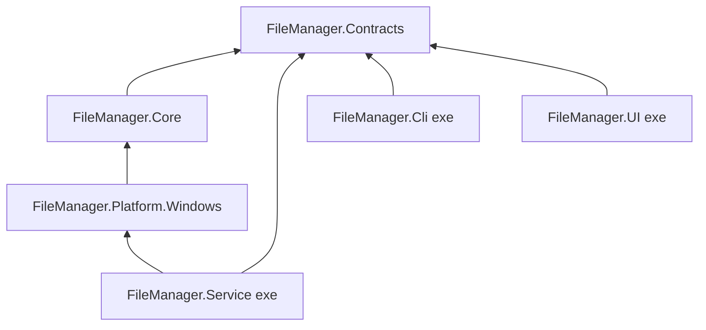
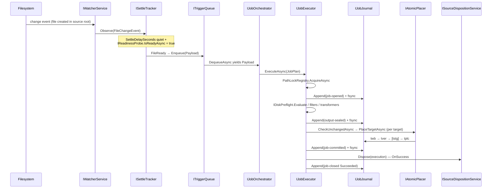
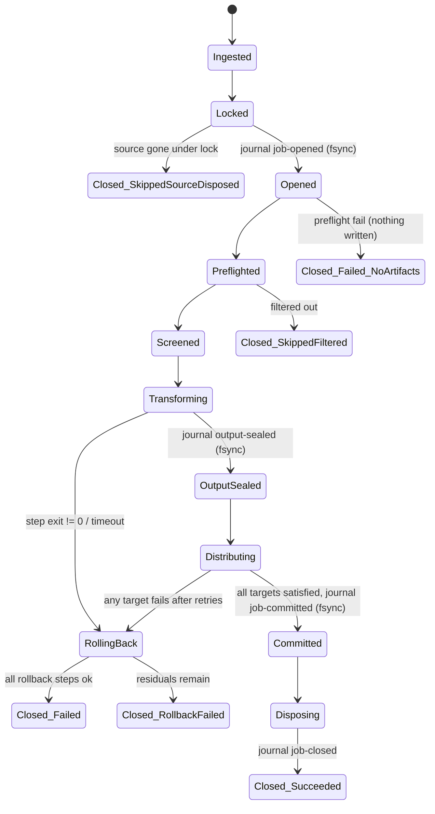

# Architecture & Type Reference: File Manager v1

**Version:** 1
**Status:** Draft for review
**Last updated:** 2026-07-09
**Authoritative behavior spec:** [`spec-draft-v3.md`](spec-draft-v3.md)

---

## Table of contents

- [§0 How to read this document](#0-how-to-read-this-document)
- [§1 Layering & dependency rules](#1-layering--dependency-rules)
- [§2 Project & process map](#2-project--process-map)
- [§3 Runtime topology & IPC protocol](#3-runtime-topology--ipc-protocol)
- [§4 Service catalog](#4-service-catalog)
  - [§4.1 Profiles subsystem](#41-profiles-subsystem)
  - [§4.2 Triggers subsystem](#42-triggers-subsystem)
  - [§4.3 Jobs subsystem](#43-jobs-subsystem)
  - [§4.4 Filtering subsystem](#44-filtering-subsystem)
  - [§4.5 Transformers subsystem](#45-transformers-subsystem)
  - [§4.6 Placement & verification subsystem](#46-placement--verification-subsystem)
  - [§4.7 Journal, recovery & audit subsystem](#47-journal-recovery--audit-subsystem)
  - [§4.8 Disposition subsystem](#48-disposition-subsystem)
  - [§4.9 IPC subsystem](#49-ipc-subsystem)
  - [§4.10 Dry-run & observability subsystem](#410-dry-run--observability-subsystem)
  - [§4.11 Platform abstraction summary](#411-platform-abstraction-summary)
- [§5 DTO & type catalog](#5-dto--type-catalog)
- [§6 End-to-end flows](#6-end-to-end-flows)
- [§7 Job lifecycle & crash-recovery state machine](#7-job-lifecycle--crash-recovery-state-machine)
- [§8 Threading & concurrency model](#8-threading--concurrency-model)
- [§9 Persistence & on-disk layout](#9-persistence--on-disk-layout)
- [§10 Extension seams (reserved features)](#10-extension-seams-reserved-features)
- [Appendix A: Type index](#appendix-a-type-index)
- [Appendix B: Invariants & acceptance-criteria trace](#appendix-b-invariants--acceptance-criteria-trace)

---

## 0. How to read this document

**Audience.** The implementer of File Manager v1, writing every line by hand. This document is
the review artifact between the functional spec and the code: read it end to end, challenge it,
then transcribe it.

**Authority.** [`spec-draft-v3.md`](spec-draft-v3.md) defines *what* the system does; this
document defines its *shape* — projects, services, types, ordering, and ownership. Behavior is
cross-referenced by spec anchor (written `spec §3.2.1`) rather than restated; if this document
and the spec conflict, **the spec wins** and this document must be amended. A careful read is
2–3 hours.

**Normative code.** Every C# listing here is normative: interfaces, records, and enums compile
as written (modulo `using` directives); concrete classes (`PathLockRegistry`,
`SelfWriteSuppressionRegistry`, `JobStateMachine`, `IpcClient`, …) are shown as their complete
public surface with bodies omitted. Each type appears exactly once, in the section that owns
it, and is referenced by name everywhere else. Doc comments appear only where behavior is not
obvious from the spec cross-reference.

**Tags.**

| Tag | Meaning |
| --- | --- |
| `[reserved]` | Schema-legal enum member/field that v1 validation rejects with a "reserved for a future release" error (spec §1.2). |
| `[seam]` | A member, branch point, or type that exists to host a reserved feature later. §10 lists them all. |
| `[platform]` | Interface with per-OS implementations; v1 ships only the Windows one. Core never contains platform branches — variance goes through these interfaces. |
| `[flagged]` | A design decision the spec does not dictate; a one-line alternative is noted for your review. |

**Conventions carried from the existing code** (stated once, applied everywhere):

- Errors are values. Expected failures return the existing `Result` / `Result<TValue, TError>`
  (`FileManager.Contracts.Primitives`); exceptions signal programmer error only. It lives in
  Contracts, not Core, so Contracts-only client plumbing (`IpcClient`, `ServiceLauncher`,
  `IpcFrameCodec`, §4.9) can return it too without Contracts needing a reference to Core.
- Types are `sealed`. Snapshot DTOs are positional records; config-like DTOs use
  `required` + `init`. Interfaces are `I`-prefixed. Namespaces mirror folders, file-scoped.
- Every engine service takes `ILogger<T>` via a primary constructor. Signatures below omit the
  logger parameter for brevity; assume it on every concrete class.
- All code is AOT-safe and reflection-free: source-generated `System.Text.Json` contexts, no
  runtime codegen, COM via `[GeneratedComInterface]`.
- No raw C# `event` fields. In-process notifications are `IDisposable Subscribe(Action<T> handler)`
  — disposing the returned handle unsubscribes — never `event Action<T> X`. This avoids the easy
  leak of a subscriber that forgets to detach. Applies to every interface below, including
  `IWatcherService`, `ISettleTracker`, `ISchedulerService`, `IPauseStateService`,
  `IProfileCatalog`, and `IEngineEventBus`.

**Review checklist for §0** — you should be able to answer: What wins on a conflict? What does
`[reserved]` require the validator to do? Where does platform variance live?

---

## 1. Layering & dependency rules

Four layers. References point strictly downward.

```
┌─────────────────────────────────────────────────────────┐
│  Hosts (composition roots only — no logic)              │
│  FileManager.Service │ FileManager.Cli │ FileManager.UI │
├─────────────────────────────────────────────────────────┤
│  Platform            FileManager.Platform.Windows        │
│  (implements Core's platform interfaces for one OS)     │
├─────────────────────────────────────────────────────────┤
│  Engine              FileManager.Core                    │
│  (all services, journal, jobs, IPC server;              │
│   defines platform interfaces; zero OS-specific code)   │
├─────────────────────────────────────────────────────────┤
│  Contracts           FileManager.Contracts               │
│  (everything serialized across a boundary + IPC client) │
└─────────────────────────────────────────────────────────┘
```

**Hard rules:**

1. **Contracts references nothing** (BCL only). It holds every type that crosses a process
   boundary: the Profile schema, IPC messages, engine events, the dry-run report — plus the thin
   IPC client plumbing used by every out-of-process client. `[flagged]` Alternative: a separate
   `FileManager.Ipc` project for the client plumbing if Contracts purity matters to you; folded
   into Contracts here because it is three small classes needed by every client.
2. **Core never references Platform.\*.** Core defines the platform interfaces
   (`FileManager.Core.Platform`, §4.11); Platform.Windows implements them. No
   `OperatingSystem.IsWindows()` branches anywhere in Core (spec §1.2: platform-neutral engine).
3. **Hosts are composition roots only.** They construct the object graph, parse arguments, and
   run; they contain no engine or business logic. `FileManager.Cli` and `FileManager.UI`
   reference **Contracts only** — they never see Core.

**AOT constraints** (Core & Contracts are `IsAotCompatible`/`IsTrimmable`; every exe publishes
AOT). Forbidden: reflection-based serialization, `Activator.CreateInstance`, runtime proxies,
classic COM interop attributes, JSON-Schema libraries (spec §5.1 — validation is engine code).
Required: `JsonSerializerContext` source generation for every serialized type,
`[GeneratedComInterface]` for the `IFileOperation` recycle-bin call, dispatch tables instead of
reflection-based handler discovery (§4.9).

**Review checklist** — Which project may Platform.Windows reference? Where do platform
interfaces live vs. their implementations? What serializer style is mandatory?

---

## 2. Project & process map

### 2.1 Assemblies

| Project | Kind | Status | References | Contents |
| --- | --- | --- | --- | --- |
| `FileManager.Contracts` | lib, AOT/trim | exists (empty stub) | — | `Result`/`Result<TValue,TError>` (`Contracts.Primitives`, relocated per §2.2), Profile schema records + all config enums (§5.1), IPC envelope/messages/events (§5.2), `DryRunReport` (§5.3), shared read models, `FileManagerJsonContext`, `IpcFrameCodec`/`IpcClient`/`ServiceLauncher` (§4.9) |
| `FileManager.Core` | lib, AOT/trim | exists | Contracts | The engine: every service in §4, the journal, jobs, IPC *server*, platform interfaces (`Core.Platform`) |
| `FileManager.Platform.Windows` | lib, AOT/trim | **new** | Core | Windows implementations of the `Core.Platform` interfaces (§4.11) |
| `FileManager.Service` | exe, PublishAot | **new** | Core, Platform.Windows, Contracts | Core Service host: DI graph, startup sequence, lifetime |
| `FileManager.Cli` | exe, PublishAot | **new** | Contracts | `filemanager` executable (spec §2.2) |
| `FileManager.UI` | exe, PublishAot | exists (template) | Contracts | Avalonia GUI + `--tray` mode + `--pick <path>` shell-prompt mode |

Test projects mirror one-to-one (xUnit, folders mirroring source):
`FileManager.Contracts.Tests`, `FileManager.Core.Tests` (exist),
`FileManager.Platform.Windows.Tests`, `FileManager.Service.Tests`, `FileManager.Cli.Tests`,
`FileManager.UI.Tests`.



### 2.2 Fate of existing types

| Existing type | Fate |
| --- | --- |
| `Result`, `Result<TValue,TError>` (`Core.Primitives`) | **Relocated** to `FileManager.Contracts.Primitives` (Contracts has zero project references, so Contracts-only IPC client plumbing — `IpcClient`, `ServiceLauncher`, `IpcFrameCodec`, §4.9 — can't otherwise return it without either duplicating it or referencing Core). Core keeps using the same type via its existing reference to Contracts; every existing Core call site is updated to the new namespace, no behavior change. |
| `IFileSystemService`, `FileSystemService`, `FileSystemEntry`, `EnumerationFault` (`Core.Files`) | **Reused unchanged** — the enumeration backbone of `ISourceScanner` (§4.2), watcher rescan, and dry-run. |
| `FileMetadata` (`Core.Files`) | **Reused unchanged** — the Job's source snapshot and the filter input (§4.4). |
| `IFilter` (`Core.Filtering`) | **Extended in place** from empty marker to the §4.4 design. |
| `Profile` (`Core.Profiles`) | **Superseded.** Delete `src/FileManager.Core/Profiles/Profile.cs`; the full record in `FileManager.Contracts.Profiles` (§5.1) replaces it, keeping the `SchemaVersion`/`Id`/`Name` member names. It moves because Profile CRUD travels over IPC (the GUI edits profiles; the service owns them) — one set of types, no mapping layer. |

### 2.3 Processes

| Process | Binary | Started by | Role |
| --- | --- | --- | --- |
| Core Service | `FileManager.Service.exe` | Logon startup task (spec §5.3); or on demand by `ServiceLauncher` | Engine. Runs recovery → IPC server → triggers (order is invariant I-RECOVER-FIRST, §7.4). |
| Tray indicator | `FileManager.UI.exe --tray` | Spawned by the Service at startup when a desktop session exists (config flag) | IPC client: subscribes to events, shows pause toggle + failure notifications. `[flagged]` Alternative: host Avalonia `TrayIcon` inside the Service — rejected; ties engine liveness to the desktop, and spec §1.1 requires the service to run trayless. |
| Configuration GUI | `FileManager.UI.exe` | User | IPC client: profile CRUD/validation, activity view, dry-run. Folder pickers use native Avalonia storage providers, not IPC browse `[flagged]` (alternative: a `BrowseDirectory` IPC message — unnecessary; the GUI runs as the same user on the same machine). |
| Profile picker prompt | `FileManager.UI.exe --pick <path>` | Windows context-menu verb (spec §5.3) | Ensures service running (`ServiceLauncher`), fetches matching profiles, **always prompts** (spec §3.2), offers "Create Profile…" when none match, submits `RunProfileRequest`. |
| CLI | `FileManager.Cli.exe` (`filemanager`) | User/scripts | Thin IPC client (spec §2.2). Doubles as the fallback service launcher. |

**Shell integration is not a project.** The HKCU verb (spec §5.3) invokes
`FileManager.UI.exe --pick "%1"`. Registration is `IShellIntegration` (§4.11), implemented in
Platform.Windows, executed **idempotently by the Service at every startup** — self-healing, no
installer dependency, no elevation (HKCU).

### 2.4 Service startup sequence (`FileManager.Service`)

1. Build DI graph (Microsoft.Extensions.Hosting generic host; all §4 services singleton unless
   noted).
2. Load engine settings (`config.json`, §9) and profiles (`IProfileStore.LoadAll` →
   `IProfileCatalog`), running validation; profiles with errors load as inactive with a surfaced
   issue.
3. **Run crash recovery to completion** (`ICrashRecovery.Recover`, §7.3). Nothing else touches
   the filesystem before this finishes.
4. Start IPC server (§4.9); accept GUI/CLI/shell connections.
5. Register shell integration idempotently (§4.11). Autostart is **not** reconciled here: the service
   writes the Run entry only on an explicit settings change, and the persisted `ServiceStartupMode` is
   reconciled against the OS startup state at **UI** startup (spec §5.3), so the app never overrides a
   startup choice the user made through Windows.
6. Start triggers: watcher (§4.2), scheduler (missed-run evaluation per spec §3.2.2), trigger
   queue consumer (§4.3). If the persisted pause state (§9) is paused, the queue gate stays shut.
7. Spawn tray client if a desktop session exists.

**Review checklist** — Which two projects may the UI reference? Who registers the context menu,
and when? What must complete before the IPC server starts?

---

## 3. Runtime topology & IPC protocol

Transport per spec §2.1: named pipe `\\.\pipe\filemanager-<user>` on Windows
(`<user>` = sanitized `Environment.UserName`; the pipe ACL restricts to the current user), Unix
domain socket **[Linux release]**. Resolution is behind `IIpcEndpointProvider` (§4.11). No
network listener, ever (spec §9).

### 3.1 Framing

Length-prefixed JSON (spec §2.1): each message is a 4-byte little-endian payload length
(sanity-capped at 16 MiB) followed by that many bytes of UTF-8 JSON. One
frame = one serialized `IpcRequest`, `IpcResponse`, or `EngineEvent` (§5.2), serialized through
`FileManagerJsonContext` with `[JsonPolymorphic]` discriminators. Implemented once in
`IpcFrameCodec` (Contracts), used by client and server.

### 3.2 Conversation model

- **Request/response:** client writes one `IpcRequest` frame, server replies with exactly one
  `IpcResponse` frame (an `ErrorResponse` on failure). Requests on one connection are handled
  sequentially; clients open parallel connections if they need concurrency.
- **Event subscription:** a client sends `SubscribeEventsRequest`; the server acknowledges, then
  the connection becomes a one-way event stream of `EngineEvent` frames until the client
  disconnects. The tray and the GUI activity view each hold one subscription connection.
- **Versioning:** every request carries `ProtocolVersion` (const `1`). The server rejects
  mismatches with `ErrorResponse("IPC_VERSION_MISMATCH", …)`.

### 3.3 Start-if-not-running handshake

`ServiceLauncher.ConnectOrStartAsync` (Contracts, §4.9): try to connect (short timeout); on
failure, start `FileManager.Service.exe` (path resolved relative to the calling binary), then
retry connecting with backoff (250 ms × 20 ≈ 5 s budget) before failing. Used by the CLI, the
GUI, and the `--pick` path — the spec §2 requirement that a shell invocation starts the service
and queues the Payload falls out of this plus the ordinary `RunProfileRequest`.

**Review checklist** — What is a frame? How does a client receive events? Who may start the
service process?

---

## 4. Service catalog

Grouped by subsystem in dependency order. Entry template: **Responsibility** (≤2 sentences) /
**Collaborators** / **Lifecycle** / interface listing / **Spec** refs / **Failure semantics**
(what its error values mean). All services are singletons resolved from the Service host's DI
container unless marked otherwise.

Merge decisions, stated once:

- **Rollback is not orchestrated by a "rollback service" per phase** — `IJobExecutor` owns the
  decision to roll back and delegates the mechanical sweep to `IRollbackExecutor` (§4.7), which
  crash recovery reuses.
- **Coalescing + pause-gating + queueing is one service** (`ITriggerQueue`).
- **Hashing is one service** (`IFileHasher`); placement, the unchanged-file short-circuit, and
  recovery all call it. There is no separate "verification service" — verification is a step
  inside `IAtomicPlacer` (§4.6) so its ordering relative to fsync and rename is not splittable.
- **Missed-run persistence lives inside the scheduler** (`state/schedule.json`, §9).

The jobs/placement/journal subsystems (§4.3, §4.6, §4.7) use the structured `JobError` type
(§5.4) as their `TError`; peripheral subsystems use `string` errors, matching the existing
`IFileSystemService` convention.

### 4.1 Profiles subsystem

Namespace `FileManager.Core.Profiles` (types consumed over IPC live in
`FileManager.Contracts.Profiles`, §5.1).

#### IProfileStore

**Responsibility:** owns `profiles/*.json` (§9): load-all at startup, save/delete on IPC
requests. Saves are atomic (write temp + rename) and validate first.
**Collaborators:** `IProfileValidator`, `FileManagerJsonContext`.
**Spec:** §5.1. **Failure semantics:** I/O and deserialization failures as messages; a save
that fails validation returns the issues, not a string.

```csharp
public interface IProfileStore
{
    Result<IReadOnlyList<Profile>, string> LoadAll();
    Result<Profile, string> Load(Guid profileId);
    /// <summary>Validates against all other stored profiles. Rejects on any Error issue always,
    /// and on any BlockingWarning issue unless acknowledgeWarnings is true (§5.2 SaveProfileRequest).</summary>
    Result<IReadOnlyList<ValidationIssue>, string> Save(Profile profile, bool acknowledgeWarnings);
    Result Delete(Guid profileId);
}
```

#### IProfileValidator

**Responsibility:** structural checks, enum/reserved-value rejection, path rules, and the
cross-profile checks of spec §3.2.3 and §5.4. Pure — no I/O beyond `Path` normalization.
**Collaborators:** none (candidate + other profiles passed in).
**Spec:** §3.2.3, §5.1, §5.4, §6.1. **Failure semantics:** returns issues; `Error` severity
blocks save/activation, `Warning` does not.

```csharp
public interface IProfileValidator
{
    IReadOnlyList<ValidationIssue> Validate(
        Profile candidate,
        IReadOnlyList<Profile> otherActiveProfiles);
}
```

Exhaustive validation codes (the GUI keys messages off these; tests assert them):

| Code | Severity | Rule (spec ref) |
| --- | --- | --- |
| `PROFILE_SCHEMA_VERSION` | Error | Unknown `SchemaVersion`. |
| `PROFILE_RESERVED_VALUE` | Error | Any `[reserved]` enum member or `ContentHashDedupe: true` (§1.2, §5.1). Message names the field and says "reserved for a future release". |
| `PROFILE_PATH_INVALID` | Error | Source/Target/Archive path not absolute, malformed, or inside `.pipeline_tmp/`/`.fm_staging/` (§3.2.3 rule 3). |
| `PROFILE_TARGET_EQUALS_SOURCE` | Error | A Target path equals a Source path of the same profile (§3.2.3; the per-job resolved check is separate, §4.3). |
| `PROFILE_NO_SOURCES` / `PROFILE_NO_TARGETS` | Error | Empty Sources or Targets. |
| `PROFILE_TRANSFORMER_INVALID` | Error | Non-contiguous `Step` numbers, missing `ExpectedOutputExtension` on `NewFile`, unparseable `Arguments` (via `IArgumentParser`, §4.5), unknown token name, `ExecutablePath` not an existing file or not on the allowlist (§9 config). |
| `PROFILE_FILTER_INVALID` | Error | Glob/regex pattern in a `FilterSet` fails to compile (via `IFilterCompiler`, §4.4). |
| `PROFILE_CRON_INVALID` / `PROFILE_TIMEZONE_INVALID` | Error | Schedule enabled with bad cron/timezone. |
| `PROFILE_ARCHIVE_MISSING` | Error | `OnSuccess: MoveToArchive` with null `ArchiveFolder`. |
| `PROFILE_TARGET_IN_SOURCE_WARN` | Warning | Target equal to/containing/contained in any watched Source, own or another active profile's (§3.2.3 rule 1 — chaining is allowed, eyes open). |
| `PROFILE_CYCLE_WARN` | Warning | Source→Target edge graph across active profiles contains a cycle (§3.2.3). |
| `PROFILE_OVERLAP_DISPOSAL_WARN` | Warning | ≥2 active profiles have overlapping Sources and ≥1 disposes sources (§5.4). |
| `PROFILE_UNVERIFIED_DELETE` | BlockingWarning | `VerificationMethod: None` + `OnSuccess: PermanentDelete` (§6.1). Save allowed only with the request's `AcknowledgeWarnings` flag set (§5.2). |
| `PROFILE_UNVERIFIED_TRASH_WARN` | Warning | `VerificationMethod: None` + `OnSuccess: MoveToTrash` (§6.1). |

#### IProfileCatalog

**Responsibility:** in-memory authoritative set of loaded profiles; notifies subscribers via
`Subscribe` so watchers/scheduler re-arm.
**Collaborators:** `IProfileStore`. **Spec:** §5.1.

```csharp
public interface IProfileCatalog
{
    IReadOnlyList<Profile> All { get; }
    IReadOnlyList<Profile> Active { get; }
    IDisposable Subscribe(Action changeHandler);
    Result Reload();
}
```

#### IProfileMatcher

**Responsibility:** which active profiles' Sources + filters match a given path — feeds the
shell picker prompt and CLI `run` validation.
**Collaborators:** `IProfileCatalog`, `IFilterCompiler`. **Spec:** §3.2 (manual invocation).

```csharp
public interface IProfileMatcher
{
    IReadOnlyList<ProfileMatch> FindMatches(string absolutePath);
}

public sealed record ProfileMatch(Guid ProfileId, string ProfileName, string MatchedSourceRoot);
```

### 4.2 Triggers subsystem

Namespaces `FileManager.Core.Watching`, `.Scheduling`, `.Triggers`.

#### IWatcherService

**Responsibility:** one `FileSystemWatcher` per distinct source root across active profiles;
raw change events out. Recovers from buffer overflow (`Error` event /
`ReadDirectoryChangesW` overrun, spec §11) by a full rescan of the affected root via
`ISourceScanner`. Never emits paths under `.pipeline_tmp/` or `.fm_staging/` (spec §3.2.3
rule 3) — checked here *and* at settle time.
**Collaborators:** `IProfileCatalog` (re-arms on `Subscribe` notifications), `ISourceScanner`,
`ISelfWriteSuppressionRegistry` (defense-in-depth pre-filter).
**Spec:** §3.2, §3.2.3, §11. **Failure semantics:** a root that cannot be watched (missing,
access denied) logs and surfaces an engine event; other roots keep running.

```csharp
public interface IWatcherService
{
    Result Start();
    void Stop();
    IDisposable Subscribe(Action<FileChangeEvent> changeHandler);   // raw, pre-settle
}

public readonly record struct FileChangeEvent(
    Guid ProfileId, string SourceRoot, string FullPath, DateTimeOffset ObservedAt);
```

#### ISettleTracker

**Responsibility:** per-(profile, path) debounce of `SettleDelaySeconds` and readiness probing;
emits a `Payload` when both spec §3.2.1 conditions hold. Consults
`ISelfWriteSuppressionRegistry.IsSuppressed` immediately before emitting.
**Collaborators:** `IReadinessProbe`, `ISelfWriteSuppressionRegistry`, `TimeProvider`.
**Spec:** §3.2.1, §3.2.3 rule 2.

```csharp
public interface ISettleTracker
{
    void Observe(FileChangeEvent change);
    IDisposable SubscribeToReady(Action<Payload> readyHandler);
}
```

#### IReadinessProbe `[platform]`

**Responsibility:** spec §3.2.1 probe. Windows: open for exclusive read. Network paths
(detected via `IVolumeInfoProvider.IsNetworkPath`): size-stability across two probes
`StabilityIntervalMs` apart, with the per-job caveat logged. Linux advisory-lock probe is a
`[seam]`.

```csharp
public interface IReadinessProbe
{
    /// <summary>Success(false) = not settled yet, retry later; Failure = the probe itself failed.</summary>
    Task<Result<bool, string>> IsReadyAsync(string path, ReadinessOptions options, CancellationToken ct);
}

public sealed record ReadinessOptions
{
    public required int StabilityIntervalMs { get; init; }
    public required bool IsNetworkPath { get; init; }
}
```

#### ISchedulerService

**Responsibility:** cron/interval evaluation per profile with timezone (spec §3.2); persists
last-fire times (`state/schedule.json`, §9); applies `MissedRunPolicy` once at startup
(`CatchUpOnce` coalesces all misses into one tick with `IsCatchUp = true`, spec §3.2.2).
**Collaborators:** `IProfileCatalog`, `TimeProvider`.
**Spec:** §3.2, §3.2.2. Cron: hand-rolled 5-field parser in `Core.Scheduling`
(`CronExpression.TryParse`) `[flagged]` — alternative: the Cronos package (MIT, AOT-friendly);
hand-rolled chosen to keep the dependency surface at zero and the code auditable.

```csharp
public interface ISchedulerService
{
    Result Start();
    void Stop();
    IDisposable Subscribe(Action<ScheduleTick> dueHandler);
}

public readonly record struct ScheduleTick(Guid ProfileId, DateTimeOffset ScheduledFor, bool IsCatchUp);
```

#### ISourceScanner

**Responsibility:** the single enumeration path that turns a profile (or one source root, or one
invoked folder) into candidate `Payload`s: recursive walk over the existing
`IFileSystemService.EnumerateEntries`, honoring `MaxDepth` and the unconditional infrastructure
exclusions. Used by schedule ticks, `CatchUpOnce`, watcher overflow rescans, folder shell
invocations, and dry-run.
**Collaborators:** `IFileSystemService` (existing). **Spec:** §3.2, §3.2.3 rule 3, §4 Phase 2.
**Failure semantics:** inherits the `EnumerationFault` Warning/Fatal contract of
`IFileSystemService` — Warnings interleave, a Fatal fault terminates the sequence.

```csharp
public interface ISourceScanner
{
    IEnumerable<Result<Payload, EnumerationFault>> Scan(
        Profile profile, TriggerKind trigger, string? scopeRoot = null);
}
```

#### ITriggerQueue

**Responsibility:** the single funnel for all payloads regardless of trigger. Coalesces on
`(ProfileId, SourcePath)` while pending; the dequeue side blocks while the engine is paused
(watcher, schedule, and manual payloads all queue — spec §3.2.4); FIFO otherwise.
**Collaborators:** `IPauseStateService`. **Spec:** §3.2.4.

```csharp
public interface ITriggerQueue
{
    void Enqueue(Payload payload);                                // coalesces duplicates
    IAsyncEnumerable<Payload> DequeueAsync(CancellationToken ct); // gate shut while paused
    int PendingCount { get; }
}
```

#### IPauseStateService

**Responsibility:** the persisted global pause flag (spec §3.2.4; survives restart —
`state/pause.json`, §9).

```csharp
public interface IPauseStateService
{
    bool IsPaused { get; }
    Result SetPaused(bool paused);
    IDisposable Subscribe(Action<bool> pauseHandler);
}
```

**Review checklist for §4.1–4.2** — Which validation codes block a save? What re-fires after a
watcher buffer overflow? Where do *all* payloads converge, and what happens to them while
paused?

---

### 4.3 Jobs subsystem

Namespaces `FileManager.Core.Jobs`, `.Locking`, `.Preflight`. Core job types (`JobId`,
`JobPlan`, `JobError`, `NormalizedPath`, …) are listed in §5.4.

#### IJobOrchestrator

**Responsibility:** consumes `ITriggerQueue` on the bounded worker pool (`MaxWorkers`, default =
CPU count, spec §5.4), builds each `JobPlan` (profile snapshot, `JobId`, resolved target plans,
deterministic workspace path), tracks in-flight jobs for status and pause-drain, and publishes
lifecycle events to `IEngineEventBus`.
**Collaborators:** `ITriggerQueue`, `IProfileCatalog`, `IJobExecutor`, `IEngineEventBus`.
**Spec:** §5.4, §3.2.4. **Failure semantics:** a payload whose profile no longer exists/is
inactive is dropped with a logged skip; executor outcomes are events, never orchestrator
failures.

```csharp
public interface IJobOrchestrator
{
    Result Start();
    /// <summary>Stops dequeuing; awaits in-flight jobs to completion (jobs are never suspended, I-ATOMIC-JOB).</summary>
    Task StopAsync(CancellationToken ct);
    EngineStatusSnapshot GetStatus();
}
```

#### IJobExecutor

**Responsibility:** runs one Job through the six phases of spec §4 exactly as ordered by the
state machine in §7.1, interleaving journal, lock, and suppression calls per the write-ahead
protocol (§7.2), and invoking `IRollbackExecutor` on any failure after `Opened`.
**Collaborators:** everything in §4.4–§4.8 plus `PathLockRegistry`,
`SelfWriteSuppressionRegistry`, `IDiskPreflight`, `IJobJournal`.
**Lifecycle:** one invocation per Job on a pool worker; the executor itself is a stateless
singleton, all per-job state lives in `JobExecution` (§5.4).
**Spec:** §4 (all phases), §3.3. **Failure semantics:** never throws for job failures — every
outcome, including `RollbackFailed`, is a `JobCompletion`.

```csharp
public interface IJobExecutor
{
    Task<JobCompletion> ExecuteAsync(JobPlan plan, CancellationToken ct);
}
```

Phase algorithm (normative ordering; states refer to §7.1):

1. **Lock** — `PathLockRegistry.AcquireAsync` over: source path, every
   `TargetPlan.ProspectiveFinalPath`, and the archive destination when
   `OnSuccess = MoveToArchive`. Then re-check the source exists; if gone →
   `JobCompletion(Skipped, SourceDisposed)` (spec §5.4 overlap rule) — no journal entry is ever
   opened.
2. **Open** — journal `job-opened` (fsync). From here on, any failure routes through rollback.
3. **Preflight** — resolved-target self-path check (hard error, spec §3.2.3) then
   `IDiskPreflight.Evaluate` (spec §4 Phase 1). Failure → `job-closed(Failed)` directly; I-WAL
   guarantees nothing was written.
4. **Screen** — `CompiledFilterSet.Evaluate` (§4.4). Excluded → `job-closed(Skipped, Filtered)`
   logged as `SKIPPED` with the deciding rule (spec §4 Phase 2).
5. **Transform** — `ITransformerChainRunner.RunAsync` (§4.5); on success compute the reference
   hash and journal `output-sealed` (fsync).
6. **Distribute + verify + place** — per target, bounded-parallel on the pool:
   `IAtomicPlacer.CheckUnchanged` (spec §3.4.1, before conflict resolution) →
   `IConflictResolver.Resolve` → `IAtomicPlacer.PlaceTarget` (§4.6). Per-target transient
   errors retried via `ITransientRetryPolicy` (spec §10). Any target failing after retries →
   cancel siblings, `IRollbackExecutor.Rollback`.
7. **Commit** — all targets `Placed` / `SatisfiedUnchanged` / `SkippedConflict` → journal
   `job-committed` (fsync). **This record alone authorizes source disposition** (I-DISPOSE).
8. **Dispose** — `ISourceDispositionService.Dispose` (§4.8); a disposition failure is logged in
   `job-closed`, never rolled back (spec §4 Phase 6). Journal `job-closed(Succeeded)`.
9. Release suppression registrations (linger window starts) and the lock set.

#### PathLockRegistry

**Responsibility:** in-process async locks keyed by `NormalizedPath` (§5.4); FIFO waiters;
deadlock-free by global ordering. Authoritative for this engine instance only — not a
cross-machine mutex (spec §5.4 network caveat).
**Spec:** §5.4. Concrete class (no interface — it is pure in-memory mechanics; tests use it
directly).

```csharp
public sealed class PathLockRegistry
{
    /// <summary>
    /// Acquires every path or waits FIFO. Deadlock-free: paths are sorted by NormalizedPath's
    /// global ordinal ordering and acquired strictly in that order by every caller, so no wait
    /// cycle can form (I-LOCK-ORDER).
    /// </summary>
    public ValueTask<PathLockSet> AcquireAsync(
        IReadOnlyCollection<NormalizedPath> paths, JobId owner, CancellationToken ct);

    /// <summary>
    /// Non-blocking acquire of one extra path while already holding a set — used only for
    /// RenameSuffix candidate probing (§4.6). Never waits, so it cannot create a wait cycle.
    /// </summary>
    public bool TryAcquireAdditional(PathLockSet held, NormalizedPath path);
}

/// <summary>Releases all held paths (reverse order) on dispose. A Job holds exactly one set for its lifetime.</summary>
public sealed class PathLockSet : IAsyncDisposable
{
    public IReadOnlyList<NormalizedPath> Paths { get; }
    public ValueTask DisposeAsync();
}
```

Internals: `Dictionary<NormalizedPath, LockEntry>` under a private monitor;
`LockEntry { JobId holder; Queue<TaskCompletionSource> waiters }`; entries removed when released
with no waiters. What a Job locks: source + prospective finals + archive destination. Temp and
staging paths are `JobId`-namespaced — no contention is possible, so they are not locked.

#### SelfWriteSuppressionRegistry

**Responsibility:** spec §3.2.3 rule 2 — every path the engine is about to write (target temp,
final, staged, archive destination) is registered *before the first byte*; the watcher path
(`IWatcherService` and `ISettleTracker`) drops events for suppressed paths. Disposal starts the
linger window (one settle window: max `SettleDelaySeconds` of any active Source containing the
path; default 2 s), so the engine's own writes never echo back — while a *different* profile
watching the target still sees the file after the window lapses (deliberate chaining).

```csharp
public sealed class SelfWriteSuppressionRegistry(TimeProvider time)
{
    public SuppressionToken Register(NormalizedPath path, JobId owner);
    /// <summary>True while the registration is active OR within its post-release linger window.</summary>
    public bool IsSuppressed(NormalizedPath path);
}

public sealed class SuppressionToken : IDisposable
{
    public NormalizedPath Path { get; }
    public void Release(TimeSpan lingerWindow);
    void IDisposable.Dispose();   // Release with the default linger
}
```

Internals: `ConcurrentDictionary<NormalizedPath, Entry>` with
`Entry { JobId owner; long expiresAtTicks /* long.MaxValue while active */ }`; expired entries
pruned lazily plus a periodic sweep.

#### IDiskPreflight

**Responsibility:** spec §4 Phase 1 free-space check, before any write.
**Collaborators:** `IVolumeInfoProvider` (§4.11). **Spec:** §4 Phase 1.

Formula — group all planned writes by volume key; for each volume `V`:

```
required(V) = workspaceNeed(V) + Σ targets on V (estimated output size = source size) 
            + safetyMargin (default 64 MiB, per volume)
```

`workspaceNeed` = 2× source size when any transformer is `NewFile` (at most two step files are
live at once — spec §4 Phase 3 step 5 frees prior intermediates); 1× when `InPlace`-only; 0 with
no transformers (no workspace is created; distribution streams from the source). Staging adds
**zero new bytes** — it is a same-volume rename (§4.6 layout) — but the prior version's space is
not freed mid-job; the formula already never subtracts the existing file's size, which *is* the
conservative accounting spec §4 Phase 1's "plus a staging copy" asks for. Best-effort by spec:
transformers may grow output; mid-job ENOSPC routes through normal rollback.

```csharp
public interface IDiskPreflight
{
    Result<DiskPreflightReport, JobError> Evaluate(JobPlan plan);
}

public sealed record DiskPreflightReport
{
    public required IReadOnlyList<VolumeEstimate> Volumes { get; init; }
}

public sealed record VolumeEstimate
{
    public required string VolumeRoot { get; init; }
    public required long RequiredBytes { get; init; }
    public required long AvailableBytes { get; init; }
    public required long SafetyMarginBytes { get; init; }
    public bool Sufficient => AvailableBytes >= RequiredBytes + SafetyMarginBytes;
}
```

### 4.4 Filtering subsystem

Namespace `FileManager.Core.Filtering`. This designs the existing empty `IFilter`.

**Model:** a `FilterSet` (Contracts record, §5.1) is *compiled once* per (profile, source) into
an ordered list of `IFilter` rules, AND-ed: the first rule that excludes decides, and its
`Description` becomes the "deciding filter" the skip log and dry-run report need (spec §4
Phase 2, §8). Include-globs/regex compile into one rule that excludes when nothing matches.
Per-source `Filters` override the profile-global set field-by-field (non-null fields win).
Compilation happens at profile load/save, so bad patterns fail validation
(`PROFILE_FILTER_INVALID`, §4.1), not mid-job.

```csharp
public readonly record struct FilterInput(
    string FullPath, string RelativePath, int Depth, FileMetadata Metadata);

public interface IFilter
{
    string Description { get; }                              // e.g. "Include glob *.wav|*.flac"
    bool Excludes(in FilterInput input, out string reason);
}

public interface IFilterCompiler
{
    /// <summary>Per-source overrides profile-global field-by-field (spec §4 Phase 2).</summary>
    Result<CompiledFilterSet, string> Compile(FilterSet? profileFilters, FilterSet? sourceFilters);
}

public sealed class CompiledFilterSet
{
    public FilterDecision Evaluate(in FilterInput input);
}

public sealed record FilterDecision(bool Matched, string? DecidingRule);
```

Rule inventory (each an internal `IFilter` implementation): `IncludePatternFilter` (globs +
regex, excludes on no-match), `ExcludePatternFilter`, `SizeBoundsFilter`, `AgeFilter`
(modified/created within/older-than), `AttributeFilter` (hidden/system/symlink follow — reads
`FileMetadata`), `DepthFilter` (`MaxDepth`). `Attributes.FollowSymlinks = false` (default)
excludes reparse points from Jobs entirely.

### 4.5 Transformers subsystem

Namespace `FileManager.Core.Transformers`.

#### IArgumentParser

**Responsibility:** quote-aware split of a `TransformerStep.Arguments` template into fixed argv
elements (spec §4 Phase 3: `ArgumentMode.Literal` — no shell, ever). Runs at validation time so
bad templates fail at save.
**Spec:** §4 Phase 3, §9.

```csharp
public interface IArgumentParser
{
    Result<IReadOnlyList<string>, string> Parse(string arguments);
}
```

#### ITokenExpander

**Responsibility:** spec §5.2 token expansion. `$name` delimiters, `$$` escape, case-sensitive
names, each token expands to exactly one value substituted as a single un-split argv element —
never re-parsed (spec §9 injection defense).
**Spec:** §5.2, §9.

```csharp
public sealed record TokenContext
{
    public required string SourceRootPath { get; init; }
    public required string StepInputPath { get; init; }
    public required string? StepOutputPath { get; init; }   // null for InPlace steps
}

public interface ITokenExpander
{
    /// <summary>Expands one argv template element. Unknown token or $output in an InPlace step = error.</summary>
    Result<string, string> ExpandElement(string templateElement, TokenContext context);
}
```

(`$filename_stem`, `$extension`, `$filename_current` derive from `StepInputPath`.)

#### IProcessRunner

**Responsibility:** child-process execution with timeout and stdout/stderr capture to the job
log. Exit codes are data, not errors.
**Spec:** §4 Phase 3 steps 4–5. **Failure semantics:** `Failure` = the process could not be
started or the capture failed; a non-zero exit or timeout is a `Success(ProcessResult)` the
chain runner interprets.

```csharp
public sealed record ProcessRequest
{
    public required string ExecutablePath { get; init; }
    public required IReadOnlyList<string> Arguments { get; init; }   // argv, no shell
    public required string WorkingDirectory { get; init; }
    public required TimeSpan Timeout { get; init; }
}

public sealed record ProcessResult(
    int ExitCode, bool TimedOut, string StdOut, string StdErr, TimeSpan Duration);

public interface IProcessRunner
{
    Task<Result<ProcessResult, string>> RunAsync(ProcessRequest request, CancellationToken ct);
}
```

#### ITransformerChainRunner

**Responsibility:** the whole of spec §4 Phase 3: creates the workspace
(`<temp root>/.pipeline_tmp/<JobId>/`, §9), copies the source in (**the original source is
never opened for write** — I-SOURCE-RO), runs each step in order with `OutputMode` handoff,
checks `SuccessExitCodes` (default `[0]`), frees the prior intermediate after each success,
enforces the executable allowlist (§9 config; spec §9).
**Collaborators:** `IArgumentParser`, `ITokenExpander`, `IProcessRunner`, `IJobLogStore`.
**Spec:** §4 Phase 3, §9. **Failure semantics:** any step's non-success exit or timeout returns
`TransformFailure`; the executor translates that into rollback.

```csharp
public interface ITransformerChainRunner
{
    /// <summary>Success: absolute path of the final artifact inside the workspace.
    /// For a profile with no transformers this returns the source path itself and creates no workspace.</summary>
    Task<Result<string, TransformFailure>> RunAsync(JobExecution execution, CancellationToken ct);
}

public sealed record TransformFailure(
    int FailedStep, string StepName, string Reason, ProcessResult? Process);
```

**Review checklist for §4.3–4.5** — What three path groups does a Job lock, and what is never
locked? Which record authorizes source disposition? Why can a crafted filename never reach a
shell? When is no workspace created?

---

### 4.6 Placement & verification subsystem

Namespace `FileManager.Core.Placement`. The most safety-critical code in the system; its exact
sequencing is normative (§7.2 write-ahead table restates it as journal rows).

**On-disk layout:**

- Target temp name: `<finalName>.fmtmp-<jobIdShort>` **in the target directory** — same volume,
  so the rename into place is atomic on NTFS.
- Staging: `<TargetRoot>\.fm_staging\<JobId>\<finalName>` — same volume as the target, so
  staging a prior version is a metadata-only rename (zero-copy, instant) and `File.Replace`
  backup semantics work. `.fm_staging` and `*.fmtmp-*` are unconditionally excluded from
  watching and filter matching (spec §3.2.3 rule 3).

#### IFileHasher

**Responsibility:** streaming SHA-256 (`SHA256.HashDataAsync` over a `FileStream`, 1 MiB
buffer) — never whole-file in memory (spec §11).

```csharp
public interface IFileHasher
{
    Task<Result<string, JobError>> HashFileAsync(string path, CancellationToken ct);
}
```

#### IConflictResolver

**Responsibility:** spec §3.4 — resolves the final name at a Target when the desired name
exists. Runs *after* the unchanged short-circuit. `RenameSuffix` probes `name (1).ext`,
`name (2).ext`, … using `PathLockRegistry.TryAcquireAdditional` (never blocking while holding
the job's lock set — §4.3): a candidate locked by another job is skipped, since that job is
about to create it.
**Spec:** §3.4. **Failure semantics:** exhausting a sane suffix bound (10 000) is an error.

```csharp
public enum ConflictAction { Write, SkipExistingKept }

public sealed record ConflictOutcome(ConflictAction Action, string FinalPath);

public interface IConflictResolver
{
    Result<ConflictOutcome, JobError> Resolve(
        string desiredFinalPath,
        ConflictResolution policy,
        SealedOutput output,          // OverwriteIfNewer compares SourceLastWriteUtc
        int sourceIndex,              // M:1 priority (below)
        Guid profileId,
        PathLockSet heldLocks);

    /// <summary>Read-only variant for dry-run (I-DRYRUN-RO): computes the outcome that Resolve
    /// would choose, without acquiring locks or consulting the priority registry's write side.</summary>
    Result<ConflictOutcome, JobError> Probe(
        string desiredFinalPath, ConflictResolution policy, DateTimeOffset incomingLastWriteUtc);
}
```

**M:1 source-order priority** (spec §3.4: "source order in the Profile defines priority when
`Overwrite`/`OverwriteIfNewer` is used"). Owner: a session-scoped, in-memory
`SourcePriorityRegistry` inside `Core.Placement` — a map of
`(ProfileId, NormalizedPath finalPath) → int sourceIndex`, written by `IAtomicPlacer` whenever a
target is `Placed`/`SatisfiedUnchanged`, read by `Resolve`: under `Overwrite`/`OverwriteIfNewer`
in a multi-source profile, an incoming file from a **higher** source index (lower priority) that
collides with a final path placed this session by a **lower** index resolves to
`SkipExistingKept` (logged with the priority reason); a lower-index incoming file overwrites
normally. Batch collisions arrive in priority order anyway because `ISourceScanner` enumerates
sources in profile order. `[flagged]` Limitation stated openly: provenance is not persisted, so
across a service restart priority degrades to arrival order — persisting a provenance index is
the same open design as `ContentHashDedupe`'s target index (spec Appendix B) and is deliberately
not built in v1.

#### IAtomicPlacer

**Responsibility:** the unchanged-file short-circuit (spec §3.4.1) and the
write-temp → fsync → verify-by-read-back → stage → atomic-rename sequence (spec §4 Phases 4–5,
§6.2). One target per call; the executor fans out.
**Collaborators:** `IFileHasher`, `IJobJournal`, `SelfWriteSuppressionRegistry`,
`ITransientRetryPolicy`, `IMetadataPreserver`.
**Spec:** §3.3, §3.4.1, §4 Phases 4–5, §6.2, §6.4, §11.

```csharp
public enum UnchangedCheckResult { NoExistingFile, ExistsDifferent, Unchanged }

public interface IAtomicPlacer
{
    /// <summary>Spec §3.4.1, BEFORE conflict resolution. Order: exists → size → (SHA256: stream
    /// hash of the existing target file vs the sealed output | None: best-effort mtime).
    /// Compares against the SEALED OUTPUT (post-transform), never the raw source.
    /// On Unchanged, journals target-unchanged. [seam: SizeTimestamp adds a branch here]</summary>
    Task<Result<UnchangedCheckResult, JobError>> CheckUnchangedAsync(
        JobExecution execution, int targetIndex, string finalPath, CancellationToken ct);

    /// <summary>Journal twb → copy to temp (hash-on-write) → Flush(true) → read-back verify →
    /// journal tver → apply metadata → [journal tstg → stage] → atomic rename → journal tplc.</summary>
    Task<Result<PlacementResult, JobError>> PlaceTargetAsync(
        PlacementRequest request, CancellationToken ct);
}

public sealed record PlacementRequest
{
    public required JobExecution Execution { get; init; }
    public required int TargetIndex { get; init; }
    public required SealedOutput Output { get; init; }
    public required string FinalPath { get; init; }        // post-conflict-resolution, lock held
    public required bool FinalExists { get; init; }
    public required OverwriteHandling OverwriteHandling { get; init; }
    public required VerificationMethod Verification { get; init; }
}

public sealed record PlacementResult
{
    public required TargetState FinalState { get; init; }  // Placed
    public required string? StagedPath { get; init; }
}
```

Placement sequence per target (normative — each numbered step maps to a §7.2 row):

1. Journal `target-write-begin` (fsync) recording temp path, final path, and whether the final
   existed. Register temp + final + staged paths in `SelfWriteSuppressionRegistry`.
2. Stream-copy workspace output → temp path, computing SHA-256 incrementally on the write.
3. **fsync point:** `fileStream.Flush(flushToDisk: true)` before closing the temp file — without
   it, "verified" would attest to cache contents, not disk contents (I-VERIFY-READBACK).
4. **Read-back verify:** re-open the temp file and stream-hash it *through the target volume*;
   compare to `SealedOutput.Sha256` (`None`: length check only). Journal `target-verified`.
   Apply best-effort metadata now, before the rename (spec §6.4; `IMetadataPreserver`, §4.11 —
   `MetadataOnConflict.FailJob` turns a detected loss into a placement failure).
5. Place:
   - Final absent → `File.Move(temp, final)` (non-overwrite variant). An unexpected existing
     file fails loudly — impossible under the path lock, so failure = external interference.
   - Final exists + `StageOverwrites` → journal `target-staged` (fsync), then
     **`File.Replace(temp, final, stagedPath, ignoreMetadataErrors: true)`** — one Win32
     `ReplaceFile` call: the new file swaps in and the prior version lands at `stagedPath`
     atomically, with **no window where the final name is absent**. Fallback when the volume
     rejects `ReplaceFile` (some SMB servers): journaled two-step
     `File.Move(final, stagedPath); File.Move(temp, final)` — the crash window between the two
     moves is covered by the recovery rows for `target-staged` (§7.3).
   - Final exists + `DirectOverwrite` → `File.Move(temp, final, overwrite: true)`
     (`MOVEFILE_REPLACE_EXISTING`, atomic on NTFS).
6. Journal `target-placed`.

> **Directory-metadata caveat (for the implementer):** .NET exposes no directory fsync and
> `File.Move` does not pass `MOVEFILE_WRITE_THROUGH`, so an OS crash immediately after
> `target-placed` can lose the rename. This is safe by design: recovery probes the filesystem
> (§7.3) and re-executes the rename from the still-present temp/staged artifacts. Do not add
> P/Invoke write-through in v1.

#### ITransientRetryPolicy

**Responsibility:** spec §10 — fixed 3 attempts × 2 s delay for transient I/O on target writes,
verification reads, and rollback steps. The interface is the `[seam]` for the post-v1
configurable backoff.

```csharp
public interface ITransientRetryPolicy
{
    Task<Result<TValue, JobError>> ExecuteAsync<TValue>(
        string operationName,
        Func<CancellationToken, Task<Result<TValue, JobError>>> operation,
        CancellationToken ct);
}
```

### 4.7 Journal, recovery & audit subsystem

Namespaces `FileManager.Core.Journal`, `.Audit`. Record types and framing are specified in
§5.5; the write-ahead protocol and recovery decision tables in §7.

#### IJobJournal

**Responsibility:** the durable, append-only, fsync'd journal (spec §6.3). Append writes one
CRC-framed NDJSON line and calls `Flush(flushToDisk: true)` before returning — that flush *is*
the durability contract ("journal X" in this document always means append **and** fsync). A
failed append fails the Job **before** the guarded filesystem action runs.
**Spec:** §6.3. **Failure semantics:** append failure = `JobError(JournalWriteFailed)` →
rollback of prior steps.

```csharp
public interface IJobJournal
{
    Result Append(JournalRecord record);
    /// <summary>All segments oldest-first; drops a torn tail line (§5.5). Recovery only.</summary>
    Result<IReadOnlyList<JournalRecord>, JobError> ReadAll();
    /// <summary>Copies OPEN-job records forward into a fresh segment, then deletes old segments (I-APPEND).</summary>
    Result Rotate();
}
```

Rotation (segment names `journal-000001.ndjsonl`, §9): when the active segment exceeds
`RotateAtBytes` (default 4 MiB) — open segment N+1; copy every record of every still-OPEN job
(has `job-opened`, no `job-closed`) from segments ≤ N into N+1; fsync; delete segments ≤ N.
Startup recovery closes every job, so the post-recovery `Rotate()` always collapses to one
fresh segment.

#### ICrashRecovery

**Responsibility:** spec §6.3 — at startup, resolves every OPEN journal entry to CLOSED, before
the IPC server starts and before any trigger fires (I-RECOVER-FIRST). Algorithm and decision
tables: §7.3.
**Collaborators:** `IJobJournal`, `IAtomicPlacer` (forward completion), `IRollbackExecutor`,
`IFileHasher`.

```csharp
public interface ICrashRecovery
{
    Result<RecoveryReport, JobError> Recover(CancellationToken ct);
}

public sealed record RecoveryReport
{
    public required int JobsRecovered { get; init; }
    public required int CompletedForward { get; init; }
    public required int RolledBack { get; init; }
    public required int CleanedPrePlacement { get; init; }
    public required IReadOnlyList<string> QuarantinedPaths { get; init; }
}
```

#### IRollbackExecutor

**Responsibility:** the mechanical spec §3.3 rollback sweep, shared by the live executor and crash
recovery. Never touches the source (I-SOURCE-RB). Best-effort: one target's rollback failure
never aborts the others.
**Spec:** §3.3, §6.2. **Failure semantics:** `RollbackResult.Complete == false` → the job closes
`RollbackFailed` with residual paths surfaced via `NotifyOnFailure` — a manual-remediation
state, **not** left OPEN (recovery would otherwise retry a known-failing rollback forever).

```csharp
public interface IRollbackExecutor
{
    Result<RollbackResult, JobError> Rollback(RollbackContext context, CancellationToken ct);
}

public sealed record RollbackContext
{
    public required JobId JobId { get; init; }
    public required JobError Cause { get; init; }
    /// <summary>Built from live state, or reconstructed from the journal by recovery.</summary>
    public required IReadOnlyList<TargetRollbackItem> Targets { get; init; }
    public required string WorkspaceDir { get; init; }
    public required OverwriteHandling OverwriteHandling { get; init; }
}

public sealed record TargetRollbackItem
{
    public required int TargetIndex { get; init; }
    public required TargetState State { get; init; }
    public required string? TempPath { get; init; }
    public required string? FinalPath { get; init; }
    public required string? StagedPath { get; init; }
    public required bool FinalExistedBeforeJob { get; init; }
}

public sealed record RollbackResult
{
    public required bool Complete { get; init; }
    public required IReadOnlyList<string> ResidualPaths { get; init; }
}
```

Ordered steps (each I/O step wrapped in `ITransientRetryPolicy`; each journals
`target-rolledback` after it runs):

1. Journal `rollback-begin` (fsync); cancel and await the job's outstanding target tasks.
2. Per target, by state:
   - `Pending` / `SatisfiedUnchanged` / `SkippedConflict` → nothing. Unchanged targets are
     **not** reverted — their content predates the job.
   - `TempWriting` / `TempWritten` / `Verified` → delete temp (`RemovedTemp`).
   - `Staged` (prior moved out, rename not yet done — two-step fallback only) →
     `File.Move(StagedPath, FinalPath)` (final is absent; plain move restores), delete temp
     (`RestoredStagedBeforePlacement`).
   - `Placed` — the spec §3.3 "including Targets already completed" clause:
     - `StageOverwrites` + prior existed → `File.Replace(StagedPath, FinalPath, null)` —
       atomic restore, no absent-window (`UnplacedAndRestored`).
     - Prior did not exist (fresh file) → `File.Delete(FinalPath)` (`UnplacedNoPrior`) — no
       half-finished set remains.
     - `DirectOverwrite` + prior existed → **leave the placed file** and journal
       `LeftInPlaceUnrecoverable` with a warning. The prior version is unrecoverable by §6.2's
       own definition; deleting the new file too would destroy the only remaining content at
       that name (§6.2 scopes DirectOverwrite rollback to un-renamed temp artifacts).
3. Delete the workspace; delete each `.fm_staging/<JobId>/` dir **only if** every staged file in
   it was restored or the job is closing `Succeeded` (I-STAGING-KEEP).
4. Terminal journal: all steps ok → `job-closed(Failed)`; any step failed →
   `job-closed(RollbackFailed)` + notification listing every residual path.

#### IDispositionAuditLog

**Responsibility:** spec §7 deletion audit trail — durable, append-only NDJSON (same framing as
the journal, own file, §9): path, action, destination/Trash location, timestamp, Job ID.

```csharp
public interface IDispositionAuditLog
{
    Result Append(DispositionAuditRecord record);
    Result<IReadOnlyList<DispositionAuditRecord>, string> ReadRecent(int count);
}

public sealed record DispositionAuditRecord(
    Guid JobId, string SourcePath, OnSuccessAction Action, string? Destination, DateTimeOffset AtUtc);
```

### 4.8 Disposition subsystem

Namespace `FileManager.Core.Disposition`.

#### ISourceDispositionService

**Responsibility:** applies `OnSuccess` (spec §4 Phase 6) after — and only after —
`job-committed` is durable (I-DISPOSE): `KeepSource` (no-op), `MoveToTrash` (via
`ITrashService`), `MoveToArchive` (move into `ArchiveFolder`, `TargetLayout` rules applied),
`PermanentDelete`. Writes the audit record. **Design addition `[flagged]`:** if any target
ended `SkippedConflict` (content intentionally not delivered there), a disposing `OnSuccess`
is downgraded to `KeepSource` with a logged warning — disposing a source that is not present at
every target would violate the spirit of I-DISPOSE. (`SatisfiedUnchanged` does **not**
downgrade — content is provably in place.) The spec does not address this combination; strike
this behavior if you disagree.
**Spec:** §4 Phase 6, §7. **Failure semantics:** a disposition failure is recorded in
`job-closed` and logged — the copies are already safe; nothing is rolled back.

```csharp
public interface ISourceDispositionService
{
    Result<DispositionAuditRecord, JobError> Dispose(JobExecution execution);
}
```

#### ITrashService `[platform]`

Windows: `IFileOperation` COM via `[GeneratedComInterface]` so `MoveToTrash` populates the real
Recycle Bin (spec §5.3). Linux FreeDesktop trash is a `[seam]`.

```csharp
public interface ITrashService
{
    Result MoveToTrash(string absolutePath);
}
```

### 4.9 IPC subsystem

Server in `FileManager.Core.Ipc`; protocol + client in `FileManager.Contracts.Ipc`. Wire
format: §3; message types: §5.2.

```csharp
// Core (server)
public interface IIpcServer
{
    Result Start();
    Task StopAsync(CancellationToken ct);
    void Broadcast(EngineEvent evt);      // fans out to all subscribed connections
}

/// <summary>One handler per request type. The Service host registers a dispatch table
/// (Dictionary&lt;string, IIpcRequestHandler&gt;) — no reflection-based discovery.</summary>
public interface IIpcRequestHandler
{
    string RequestType { get; }
    Task<IpcResponse> HandleAsync(IpcRequest request, CancellationToken ct);
}
```

Handlers (one class each, thin delegation to §4 services): `GetStatus`, `ListProfiles`,
`GetProfile`, `SaveProfile`, `DeleteProfile`, `ValidateProfile`, `GetMatchingProfiles`,
`RunProfile`, `SetPaused`, `DryRun`, `GetRecentJobs`, `GetJobLog`, `SubscribeEvents`.

```csharp
// Contracts (client side)
public sealed class IpcClient : IAsyncDisposable
{
    public static Task<Result<IpcClient, string>> ConnectAsync(CancellationToken ct);
    public Task<Result<TResponse, IpcError>> RequestAsync<TResponse>(
        IpcRequest request, CancellationToken ct) where TResponse : IpcResponse;
    public IAsyncEnumerable<EngineEvent> SubscribeAsync(CancellationToken ct);
    public ValueTask DisposeAsync();
}

public sealed record IpcError(string Code, string Message);

public static class ServiceLauncher
{
    /// <summary>Connect; on failure start FileManager.Service.exe and retry (§3.3).</summary>
    public static Task<Result<IpcClient, string>> ConnectOrStartAsync(CancellationToken ct);
}

public static class IpcFrameCodec
{
    public static Task WriteFrameAsync(Stream stream, ReadOnlyMemory<byte> payload, CancellationToken ct);
    public static Task<Result<byte[], string>> ReadFrameAsync(Stream stream, CancellationToken ct);
}

public static class IpcEndpoint
{
    /// <summary>Client-side endpoint name: \\.\pipe\filemanager-&lt;user&gt; on Windows;
    /// $XDG_RUNTIME_DIR/filemanager.sock on Linux [seam]. Deliberately duplicates the server-side
    /// derivation in Core.Platform's IIpcEndpointProvider (§4.11 note) — Contracts cannot see Core.</summary>
    public static string Resolve();
}
```

**CLI command surface** (spec §2.2 — each maps to one request; exit code 0 on success, 1 on
engine error, 2 on unreachable service):

| Command | Request | Notes |
| --- | --- | --- |
| `filemanager status` | `GetStatusRequest` | Prints `EngineStatusSnapshot`; exit 0 iff reachable. |
| `filemanager list-profiles` | `ListProfilesRequest` | ID, name, active flag, trigger summary. |
| `filemanager run <profile> <path>` | `RunProfileRequest` | Profile by name or ID; bypasses the picker (spec §3.2); starts the service via `ServiceLauncher`. |
| `filemanager pause` / `resume` | `SetPausedRequest` | Global pause (spec §3.2.4). |

### 4.10 Dry-run & observability subsystem

Namespaces `FileManager.Core.DryRun`, `.Observability`.

#### IDryRunEngine

**Responsibility:** spec §8 — simulates a full run with **zero filesystem mutation**
(I-DRYRUN-RO): reuses `ISourceScanner`, `CompiledFilterSet`, `IConflictResolver.Probe` (the
lock-free read-only member, §4.6), `ITokenExpander`, and the unchanged-check read path of
`IAtomicPlacer`/`IFileHasher`. Reports
matches with deciding filters, unchanged skips, fully-expanded transformer argv, every target
write/overwrite/rename, and the source disposition that would occur. Transformers are **not**
executed — expanded commands are reported, and the unchanged-check for transformer profiles is
reported as `Unknown (requires transform)` since the output does not exist to hash.
**Spec:** §8. **Report type:** `DryRunReport` (§5.3).

```csharp
public interface IDryRunEngine
{
    Task<Result<DryRunReport, string>> SimulateAsync(
        Guid profileId, string? scopePath, CancellationToken ct);
}
```

#### IEngineEventBus

**Responsibility:** in-proc pub/sub for `EngineEvent`s (§5.2). Subscribers: the IPC broadcast,
the rotating service log (verbosity-filtered per `LogVerbosity`, spec §7), and job bookkeeping.

```csharp
public interface IEngineEventBus
{
    void Publish(EngineEvent evt);
    IDisposable Subscribe(Action<EngineEvent> handler);
}
```

#### IJobLogStore

**Responsibility:** per-job drill-down logs for the GUI activity view (spec §7): transformer
stdout/stderr, retries, verification results, skip reasons.

```csharp
public interface IJobLogStore
{
    Result Append(Guid jobId, string line);
    Result<IReadOnlyList<string>, string> Read(Guid jobId);
    Result<IReadOnlyList<JobSummary>, string> ListRecent(int count);
}

public sealed record JobSummary(
    Guid JobId, Guid ProfileId, string SourcePath, JobOutcome Outcome,
    SkipReason? SkipReason, DateTimeOffset StartedAtUtc, TimeSpan Duration);
```

### 4.11 Platform abstraction summary

All in namespace `FileManager.Core.Platform`; implementations in
`FileManager.Platform.Windows`. Rule 2 of §1 applies: Core code depends only on these
interfaces.

| Interface | Windows implementation | Linux `[seam]` |
| --- | --- | --- |
| `IReadinessProbe` (§4.2) | `WindowsReadinessProbe` — exclusive-open; size-stability for network paths | advisory-lock check + size stability (spec §3.2.1) |
| `ITrashService` (§4.8) | `WindowsTrashService` — `IFileOperation`, `[GeneratedComInterface]` | FreeDesktop trash (spec §5.3) |
| `IVolumeInfoProvider` (below) | `WindowsVolumeInfoProvider` — `DriveInfo` + UNC/`GetDriveType` | statvfs / mount table |
| `IShellIntegration` (below) | `WindowsShellIntegration` — HKCU `shell` verbs for `Directory`, `Directory\Background`, `AllFilesystemObjects` (spec §5.3) | per-file-manager actions (spec §5.3) |
| `IAutostartRegistrar` (below) | `WindowsAutostartRegistrar` — HKCU Run entry + effective-state query (present *and* not disabled in `StartupApproved\Run`), for the UI-startup reconciliation of `ServiceStartupMode` (spec §5.3) | systemd user unit + enabled-state query |
| `IIpcEndpointProvider` (below) | `WindowsIpcEndpointProvider` — named pipe `\\.\pipe\filemanager-<user>` | `$XDG_RUNTIME_DIR/filemanager.sock` |
| `IMetadataPreserver` (below) | `WindowsMetadataPreserver` — timestamps + ACL best-effort; detects lossy transitions pre-copy (spec §6.4) | mode bits |

```csharp
public interface IVolumeInfoProvider
{
    Result<long, string> GetAvailableFreeBytes(string path);
    /// <summary>Stable key grouping paths that share a volume (drive root or UNC share root).</summary>
    Result<string, string> GetVolumeKey(string path);
    bool IsNetworkPath(string path);
}

public interface IShellIntegration
{
    Result RegisterContextMenu();      // idempotent; run at every service start
    Result UnregisterContextMenu();
}

public interface IAutostartRegistrar
{
    Result RegisterAutostart();        // idempotent; written only on an explicit settings change
    Result UnregisterAutostart();      // idempotent
    /// <summary>Effective OS startup state: the Run entry exists AND is not disabled in
    /// StartupApproved\Run. Drives the UI-startup reconciliation of ServiceStartupMode (spec §5.3).</summary>
    Result<bool, string> IsEffectivelyRegistered();
}

public interface IIpcEndpointProvider
{
    /// <summary>Server side: a listening stream for one connection cycle.</summary>
    Task<Result<Stream, string>> AcceptAsync(CancellationToken ct);
}

public interface IMetadataPreserver
{
    /// <summary>Detects lossy metadata transitions before the copy (spec §6.4).</summary>
    Result<MetadataLossReport, string> Inspect(string sourcePath, string targetDirectory);
    /// <summary>Applies timestamps/ACLs best-effort to the temp file before rename.</summary>
    Result Apply(string fromPath, string toPath, MetadataOnConflict onConflict);
}

public sealed record MetadataLossReport(bool LossDetected, IReadOnlyList<string> Details);
```

(The IPC *client* connects via `NamedPipeClientStream` inside `IpcClient` — Contracts cannot see
`Core.Platform`; the pipe name derivation is duplicated in `Contracts.Ipc.IpcEndpoint`, a
deliberate, tiny duplication `[flagged]`.)

**Review checklist for §4.6–4.11** — At which exact moment is `File.Replace` preferred over
two moves, and what covers the fallback's crash window? Why is a `DirectOverwrite` rollback
allowed to leave the new file? What must recovery finish before? Which interfaces would a Linux
port implement?

---

## 5. DTO & type catalog

### 5.1 Profile schema — `FileManager.Contracts.Profiles`

The full spec §5.1 shape. This listing supersedes the `Core.Profiles.Profile` stub (§2.2).
Serialized by `FileManagerJsonContext`; property names match the spec's JSON exactly.

```csharp
public sealed record Profile
{
    public required int SchemaVersion { get; init; }              // 2
    [JsonPropertyName("ProfileId")]
    public required Guid Id { get; init; }
    public required string Name { get; init; }
    public required bool Active { get; init; }
    public required SyncMode SyncMode { get; init; }
    public required TargetLayout TargetLayout { get; init; }
    public required TriggerSettings Triggers { get; init; }
    public required IReadOnlyList<SourceConfig> Sources { get; init; }
    public IReadOnlyList<TransformerStep>? Transformers { get; init; }
    public required IReadOnlyList<TargetConfig> Targets { get; init; }
    public required PolicySettings Policies { get; init; }
    public FilterSet? Filters { get; init; }
    public required LoggingSettings Logging { get; init; }
}

public sealed record TriggerSettings
{
    public required bool ManualShell { get; init; }
    public required bool Watcher { get; init; }
    public ScheduleSettings? Schedule { get; init; }
}

public sealed record ScheduleSettings
{
    public required bool Enabled { get; init; }
    public required string Cron { get; init; }
    public required string Timezone { get; init; }                // IANA or Windows ID; default system-local
    public required MissedRunPolicy MissedRunPolicy { get; init; }
}

public sealed record SourceConfig
{
    public required string Path { get; init; }                    // absolute, machine-specific
    public int SettleDelaySeconds { get; init; } = 2;
    public int StabilityIntervalMs { get; init; } = 500;
    public FilterSet? Filters { get; init; }                      // overrides profile-global, field-by-field
}

public sealed record TransformerStep
{
    public required int Step { get; init; }                       // 1-based, contiguous
    public required string Name { get; init; }
    public required string ExecutablePath { get; init; }
    public required ArgumentMode ArgumentMode { get; init; }
    public required string Arguments { get; init; }
    public required OutputMode OutputMode { get; init; }
    public string? ExpectedOutputExtension { get; init; }         // required when OutputMode = NewFile
    public IReadOnlyList<int>? SuccessExitCodes { get; init; }    // default [0]
    public required int TimeoutSeconds { get; init; }
}

public sealed record TargetConfig
{
    public required string Path { get; init; }
}

public sealed record PolicySettings
{
    public required ConflictResolution ConflictResolution { get; init; }
    public required OverwriteHandling OverwriteHandling { get; init; }
    public required VerificationMethod VerificationMethod { get; init; }
    public required OnSuccessAction OnSuccess { get; init; }
    public string? ArchiveFolder { get; init; }                   // required when OnSuccess = MoveToArchive
    public required OnFailureAction OnFailure { get; init; }
    public required MetadataOnConflict MetadataOnConflict { get; init; }
}

public sealed record FilterSet
{
    public IReadOnlyList<string>? Include { get; init; }          // globs
    public IReadOnlyList<string>? ExcludeGlob { get; init; }
    public IReadOnlyList<string>? IncludeRegex { get; init; }
    public IReadOnlyList<string>? ExcludeRegex { get; init; }
    public long? MinSizeBytes { get; init; }
    public long? MaxSizeBytes { get; init; }
    public TimeSpan? ModifiedWithin { get; init; }
    public TimeSpan? ModifiedOlderThan { get; init; }
    public TimeSpan? CreatedWithin { get; init; }
    public AttributeFilterSettings? Attributes { get; init; }
    public int? MaxDepth { get; init; }
    public bool ContentHashDedupe { get; init; }                  // [reserved — must be false in v1]
}

public sealed record AttributeFilterSettings
{
    public bool IncludeHidden { get; init; }
    public bool IncludeSystem { get; init; }
    public bool FollowSymlinks { get; init; }
}

public sealed record LoggingSettings
{
    public required LogVerbosity Verbosity { get; init; }
    public required bool NotifyOnFailure { get; init; }
}
```

Enums — spec §5.1 "Enum authority" table, verbatim. Members marked `[reserved]` are
schema-legal and rejected by `IProfileValidator` with `PROFILE_RESERVED_VALUE`. Enums serialize
as strings via `JsonStringEnumConverter<T>` (the generic, AOT-safe form); the one JSON-literal
mismatch is handled with `[JsonStringEnumMemberName]` (.NET 10, AOT-safe):

```csharp
public enum SyncMode
{
    AdditiveArchive,
    Mirror,               /// [reserved — fails v1 validation]
}

public enum TargetLayout { PreserveStructure, Flatten }

public enum ConflictResolution { Overwrite, OverwriteIfNewer, RenameSuffix, Skip }

public enum OverwriteHandling { DirectOverwrite, StageOverwrites }

public enum VerificationMethod
{
    [JsonStringEnumMemberName("SHA256")]
    Sha256,
    None,
    SizeTimestamp,        /// [reserved — fails v1 validation]
}

public enum OnSuccessAction { KeepSource, MoveToTrash, MoveToArchive, PermanentDelete }

public enum OnFailureAction { AbortRestoreAndClean }   // single value; extension point (spec §5.1)

public enum MetadataOnConflict { WarnAndContinue, FailJob }

public enum ArgumentMode
{
    Literal,
    Shell,                /// [reserved — fails v1 validation]
}

public enum OutputMode { NewFile, InPlace }

public enum MissedRunPolicy { CatchUpOnce, Skip }

public enum LogVerbosity { FailuresOnly, FailuresAndSkips, All }
```

### 5.2 IPC messages & shared read models — `FileManager.Contracts.Ipc`

Polymorphic envelopes, source-gen compatible:

```csharp
[JsonPolymorphic(TypeDiscriminatorPropertyName = "type")]
[JsonDerivedType(typeof(GetStatusRequest), "get-status")]
[JsonDerivedType(typeof(ListProfilesRequest), "list-profiles")]
[JsonDerivedType(typeof(GetProfileRequest), "get-profile")]
[JsonDerivedType(typeof(SaveProfileRequest), "save-profile")]
[JsonDerivedType(typeof(DeleteProfileRequest), "delete-profile")]
[JsonDerivedType(typeof(ValidateProfileRequest), "validate-profile")]
[JsonDerivedType(typeof(GetMatchingProfilesRequest), "get-matching")]
[JsonDerivedType(typeof(RunProfileRequest), "run-profile")]
[JsonDerivedType(typeof(SetPausedRequest), "set-paused")]
[JsonDerivedType(typeof(DryRunRequest), "dry-run")]
[JsonDerivedType(typeof(GetRecentJobsRequest), "get-recent-jobs")]
[JsonDerivedType(typeof(GetJobLogRequest), "get-job-log")]
[JsonDerivedType(typeof(SubscribeEventsRequest), "subscribe")]
public abstract record IpcRequest
{
    public int ProtocolVersion { get; init; } = 1;
}

public sealed record GetStatusRequest : IpcRequest;
public sealed record ListProfilesRequest : IpcRequest;
public sealed record GetProfileRequest : IpcRequest { public required Guid ProfileId { get; init; } }
public sealed record SaveProfileRequest : IpcRequest
{
    public required Profile Profile { get; init; }
    /// <summary>Set when the user confirmed blocking warnings (e.g. PROFILE_UNVERIFIED_DELETE, §4.1).</summary>
    public bool AcknowledgeWarnings { get; init; }
}
public sealed record DeleteProfileRequest : IpcRequest { public required Guid ProfileId { get; init; } }
public sealed record ValidateProfileRequest : IpcRequest { public required Profile Profile { get; init; } }
public sealed record GetMatchingProfilesRequest : IpcRequest { public required string Path { get; init; } }
public sealed record RunProfileRequest : IpcRequest
{
    public required Guid ProfileId { get; init; }
    public required string Path { get; init; }        // file or folder (folder → recursive per MaxDepth)
}
public sealed record SetPausedRequest : IpcRequest { public required bool Paused { get; init; } }
public sealed record DryRunRequest : IpcRequest
{
    public required Guid ProfileId { get; init; }
    public string? ScopePath { get; init; }
}
public sealed record GetRecentJobsRequest : IpcRequest { public int Count { get; init; } = 50; }
public sealed record GetJobLogRequest : IpcRequest { public required Guid JobId { get; init; } }
public sealed record SubscribeEventsRequest : IpcRequest;
```

```csharp
[JsonPolymorphic(TypeDiscriminatorPropertyName = "type")]
[JsonDerivedType(typeof(OkResponse), "ok")]
[JsonDerivedType(typeof(ErrorResponse), "error")]
[JsonDerivedType(typeof(StatusResponse), "status")]
[JsonDerivedType(typeof(ProfileListResponse), "profile-list")]
[JsonDerivedType(typeof(ProfileResponse), "profile")]
[JsonDerivedType(typeof(ValidationResponse), "validation")]
[JsonDerivedType(typeof(MatchingProfilesResponse), "matching")]
[JsonDerivedType(typeof(DryRunResponse), "dry-run-report")]
[JsonDerivedType(typeof(RecentJobsResponse), "recent-jobs")]
[JsonDerivedType(typeof(JobLogResponse), "job-log")]
public abstract record IpcResponse;

public sealed record OkResponse : IpcResponse;
public sealed record ErrorResponse : IpcResponse
{
    public required string Code { get; init; }        // e.g. "IPC_VERSION_MISMATCH", "PROFILE_NOT_FOUND"
    public required string Message { get; init; }
}
public sealed record StatusResponse : IpcResponse { public required EngineStatusSnapshot Status { get; init; } }
public sealed record ProfileListResponse : IpcResponse { public required IReadOnlyList<ProfileSummary> Profiles { get; init; } }
public sealed record ProfileResponse : IpcResponse { public required Profile Profile { get; init; } }
public sealed record ValidationResponse : IpcResponse { public required IReadOnlyList<ValidationIssue> Issues { get; init; } }
public sealed record MatchingProfilesResponse : IpcResponse { public required IReadOnlyList<ProfileMatchDto> Matches { get; init; } }
public sealed record DryRunResponse : IpcResponse { public required DryRunReport Report { get; init; } }
public sealed record RecentJobsResponse : IpcResponse { public required IReadOnlyList<JobSummaryDto> Jobs { get; init; } }
public sealed record JobLogResponse : IpcResponse { public required IReadOnlyList<string> Lines { get; init; } }
```

Engine events (one-way stream after `SubscribeEventsRequest`):

```csharp
[JsonPolymorphic(TypeDiscriminatorPropertyName = "type")]
[JsonDerivedType(typeof(JobStartedEvent), "job-started")]
[JsonDerivedType(typeof(JobCompletedEvent), "job-completed")]
[JsonDerivedType(typeof(JobFailedEvent), "job-failed")]
[JsonDerivedType(typeof(PauseChangedEvent), "pause-changed")]
[JsonDerivedType(typeof(ProfilesChangedEvent), "profiles-changed")]
[JsonDerivedType(typeof(EngineWarningEvent), "engine-warning")]
public abstract record EngineEvent
{
    public required DateTimeOffset AtUtc { get; init; }
}

public sealed record JobStartedEvent : EngineEvent
{
    public required Guid JobId { get; init; }
    public required Guid ProfileId { get; init; }
    public required string SourcePath { get; init; }
}
public sealed record JobCompletedEvent : EngineEvent { public required JobSummaryDto Job { get; init; } }
public sealed record JobFailedEvent : EngineEvent
{
    public required JobSummaryDto Job { get; init; }
    public required string Error { get; init; }
    /// <summary>The profile's Logging.NotifyOnFailure, stamped by the service at publish time so
    /// the Contracts-only tray can decide whether to raise a native notification (spec §7).</summary>
    public required bool NotifyOnFailure { get; init; }
    /// <summary>Non-empty when rollback itself failed — paths needing manual remediation.</summary>
    public IReadOnlyList<string> ResidualPaths { get; init; } = [];
}
public sealed record PauseChangedEvent : EngineEvent { public required bool Paused { get; init; } }
public sealed record ProfilesChangedEvent : EngineEvent;
public sealed record EngineWarningEvent : EngineEvent { public required string Message { get; init; } }
```

Shared read models:

```csharp
public sealed record EngineStatusSnapshot(
    bool Paused, int ActiveProfiles, int JobsInFlight, int QueuedPayloads, string? LastError);

public sealed record ProfileSummary(
    Guid ProfileId, string Name, bool Active, string TriggerSummary);

public sealed record ProfileMatchDto(Guid ProfileId, string ProfileName, string MatchedSourceRoot);

/// <summary>Warning: informational, never blocks. BlockingWarning: blocks a save unless the
/// request sets AcknowledgeWarnings (spec §6.1's "blocking warning"). Error: always blocks.</summary>
public enum ValidationSeverity { Warning, BlockingWarning, Error }

public sealed record ValidationIssue(ValidationSeverity Severity, string Code, string Message);

public sealed record JobSummaryDto(
    Guid JobId, Guid ProfileId, string SourcePath, string Outcome,
    string? SkipReason, DateTimeOffset StartedAtUtc, TimeSpan Duration);
```

`FileManagerJsonContext` (Contracts) is the single source-generated
`JsonSerializerContext` covering `Profile`, `IpcRequest`, `IpcResponse`, `EngineEvent`, and
`DryRunReport` graphs. Core has a second, `internal` `JournalJsonContext` (§5.5) so engine
internals never leak into the public serialization surface.

### 5.3 Dry-run report — `FileManager.Contracts.DryRun`

```csharp
public sealed record DryRunReport(
    Guid ProfileId, DateTimeOffset GeneratedAt, IReadOnlyList<DryRunFileResult> Files);

public enum DryRunFileDisposition { WouldProcess, WouldSkipFilter, WouldSkipUnchanged }

public sealed record DryRunFileResult
{
    public required string SourcePath { get; init; }
    public string? SourceRoot { get; init; }                      // originating Source; GUI groups/filters by it
    public required DryRunFileDisposition Disposition { get; init; }
    public string? DecidingFilter { get; init; }                  // set for WouldSkipFilter
    /// <summary>Fully token-expanded argv per transformer step, joined for display. Empty if no transformers.</summary>
    public IReadOnlyList<string> ExpandedCommands { get; init; } = [];
    public IReadOnlyList<DryRunTargetAction> Targets { get; init; } = [];
    /// <summary>e.g. "MoveToTrash", "KeepSource". Deletions/overwrites are the report's whole point (spec §8).</summary>
    public string? SourceDisposition { get; init; }
}

public enum DryRunTargetKind { WouldWrite, WouldOverwrite, WouldRenameTo, WouldSkipConflict, WouldSkipUnchanged, Unknown }

public sealed record DryRunTargetAction
{
    public required string TargetPath { get; init; }
    public required DryRunTargetKind Kind { get; init; }
    public string? Detail { get; init; }   // e.g. existing file's mtime, or the suffixed name
}
```

### 5.4 Core job types — `FileManager.Core.Jobs`, `.Locking`

```csharp
public enum JobErrorCode
{
    SelfPathTarget, InsufficientDiskSpace, SourceDisposed, SourceUnreadable,
    TransformerFailed, TransformerTimeout, TargetWriteFailed, VerificationMismatch,
    StagingFailed, PlacementFailed, DispositionFailed, RollbackIncomplete,
    JournalWriteFailed, LockTimeout, MetadataConflict, ConflictUnresolvable
}

public sealed record JobError
{
    public required JobErrorCode Code { get; init; }
    public required string Message { get; init; }
    public string? Path { get; init; }
    public int? TargetIndex { get; init; }
}

public readonly record struct JobId(Guid Value)
{
    public static JobId New() => new(Guid.CreateVersion7());       // time-ordered — sorts by creation
    public string Short => Value.ToString("N")[..8];               // temp-file suffix (§4.6)
}

/// <summary>Absolute, Path.GetFullPath-canonicalized, trailing-separator-trimmed.
/// Equality/hash: OrdinalIgnoreCase on Windows. Comparison defines the global lock order (I-LOCK-ORDER).</summary>
public readonly record struct NormalizedPath : IComparable<NormalizedPath>
{
    public string Value { get; }
    public static Result<NormalizedPath, JobError> Create(string path);
    public int CompareTo(NormalizedPath other);
    public bool IsUnder(NormalizedPath ancestor);                  // containment checks for validation
}

public enum TriggerKind { Watcher, Schedule, CatchUp, ManualShell, Cli }

public sealed record Payload(
    Guid ProfileId, string SourcePath, string SourceRoot, TriggerKind Trigger, DateTimeOffset EnqueuedAt);

/// <summary>Immutable snapshot at journal-open; recovery compares the filesystem against it.</summary>
public sealed record SourceSnapshot
{
    public required string Path { get; init; }
    public required long SizeBytes { get; init; }
    public required DateTimeOffset LastWriteUtc { get; init; }
}

public sealed record TargetPlan
{
    public required int TargetIndex { get; init; }
    public required string TargetRoot { get; init; }
    /// <summary>TargetLayout-resolved destination, before conflict-resolution suffixing.</summary>
    public required string ProspectiveFinalPath { get; init; }
}

/// <summary>The policy fields the journal snapshots so recovery never depends on a profile edit.</summary>
public sealed record PolicySnapshot
{
    public required VerificationMethod Verification { get; init; }
    public required OverwriteHandling OverwriteHandling { get; init; }
    public required ConflictResolution ConflictResolution { get; init; }
    public required OnSuccessAction OnSuccess { get; init; }
    public string? ArchiveFolder { get; init; }
    public required MetadataOnConflict MetadataOnConflict { get; init; }
}

public sealed record JobPlan
{
    public required JobId JobId { get; init; }
    public required Guid ProfileId { get; init; }
    public required Profile Profile { get; init; }                 // full snapshot for the executor
    public required Payload Payload { get; init; }
    public required SourceSnapshot Source { get; init; }
    public required FileMetadata SourceMetadata { get; init; }     // existing Core.Files type
    public required IReadOnlyList<TargetPlan> Targets { get; init; }
    public required PolicySnapshot Policies { get; init; }
    public required string WorkspaceDir { get; init; }             // <tempRoot>/.pipeline_tmp/<JobId>/
}

/// <summary>Sealed transform output — the reference every verification compares against (§7.1 state OutputSealed).</summary>
public sealed record SealedOutput
{
    public required string Path { get; init; }         // workspace artifact; == source path when no transformers
    public required long SizeBytes { get; init; }
    public required string Sha256 { get; init; }       // "" when VerificationMethod.None
    public required DateTimeOffset SourceLastWriteUtc { get; init; }
}

/// <summary>Mutable per-job execution state, owned by one pool worker; wraps the plan,
/// the state machine, the lock set, suppression tokens, and per-target progress.</summary>
public sealed class JobExecution
{
    public required JobPlan Plan { get; init; }
    public JobStateMachine States { get; }
    public SealedOutput? Output { get; set; }
    public IReadOnlyList<TargetProgress> Targets { get; }
}

public sealed class TargetProgress
{
    public required TargetPlan Plan { get; init; }
    public TargetState State { get; set; }
    public string? TempPath { get; set; }
    public string? FinalPath { get; set; }             // post-conflict-resolution
    public string? StagedPath { get; set; }
    public bool FinalExistedBeforeJob { get; set; }
}

public enum JobState
{
    Ingested, Locked, Opened, Preflighted, Screened, Transforming,
    OutputSealed, Distributing, Committed, Disposing, RollingBack, Closed
}

public enum TargetState
{
    Pending, SatisfiedUnchanged, SkippedConflict, TempWriting, TempWritten,
    Verified, Staged, Placed, RolledBack, RollbackFailed
}

public enum JobOutcome { Succeeded, Skipped, Failed, RollbackFailed }

public enum SkipReason { Filtered, SourceDisposed, UnchangedAtAllTargets }

public sealed record JobCompletion(
    JobId JobId, JobOutcome Outcome, SkipReason? SkipReason, JobError? Error, TimeSpan Duration);
```

`Closed` is a single `JobState`; the terminal *outcome* travels in `JobCompletion` and
`JobClosedRecord`, not in the state enum (the §7.1 diagram's `Closed_…` nodes are
outcome-annotated views of the one state).

`JobStateMachine` (states and transitions defined in §7.1) enforces legality; an illegal
transition **throws** — it is programmer error, not an expected failure:

```csharp
public sealed class JobStateMachine(JobId jobId)
{
    public JobState State { get; }
    public IReadOnlyList<TargetState> TargetStates { get; }
    public void Transition(JobState to);                    // throws InvalidOperationException on illegal move
    public void TransitionTarget(int targetIndex, TargetState to);
}
```

### 5.5 Journal records & framing — `FileManager.Core.Journal`

**Physical line format** (append-only NDJSON segments, §9):

```
J1 <crc32c:8-hex> <json-payload>\n
```

`J1` = format version. CRC-32C over the UTF-8 payload bytes (`System.IO.Hashing` package —
AOT-safe; the solution's only new dependency `[flagged]`). **Torn-write handling:** the journal
is fsync'd per record, so only the final line of the newest segment can be torn — a tail line
missing `\n` or failing CRC is discarded silently (the guarded action either didn't happen or
is resolved by recovery's filesystem probe). A CRC failure in a *non-tail* position is a
hardware-integrity event: log an integrity alert, skip the record, and recover that job via the
conservative roll-back branch.

```csharp
[JsonPolymorphic(TypeDiscriminatorPropertyName = "t")]
[JsonDerivedType(typeof(JobOpenedRecord), "open")]
[JsonDerivedType(typeof(OutputSealedRecord), "sealed")]
[JsonDerivedType(typeof(TargetWriteBeginRecord), "twb")]
[JsonDerivedType(typeof(TargetVerifiedRecord), "tver")]
[JsonDerivedType(typeof(TargetStagedRecord), "tstg")]
[JsonDerivedType(typeof(TargetPlacedRecord), "tplc")]
[JsonDerivedType(typeof(TargetUnchangedRecord), "tunc")]
[JsonDerivedType(typeof(TargetSkippedRecord), "tskp")]
[JsonDerivedType(typeof(JobCommittedRecord), "commit")]
[JsonDerivedType(typeof(RollbackBeginRecord), "rbbegin")]
[JsonDerivedType(typeof(TargetRolledBackRecord), "trb")]
[JsonDerivedType(typeof(JobClosedRecord), "close")]
public abstract record JournalRecord
{
    public required Guid JobId { get; init; }
    public required long Seq { get; init; }            // monotonic per journal writer
    public required DateTimeOffset AtUtc { get; init; }
}

public sealed record JobOpenedRecord : JournalRecord
{
    public required Guid ProfileId { get; init; }
    public required SourceSnapshot Source { get; init; }
    public required PolicySnapshot Policies { get; init; }
    public required string WorkspaceDir { get; init; }
    public required IReadOnlyList<TargetPlan> Targets { get; init; }
}

public sealed record OutputSealedRecord : JournalRecord
{
    public required string OutputPath { get; init; }
    public required long SizeBytes { get; init; }
    public required string Sha256 { get; init; }       // "" for VerificationMethod.None
}

public sealed record TargetWriteBeginRecord : JournalRecord
{
    public required int TargetIndex { get; init; }
    public required string TempPath { get; init; }
    public required string FinalPath { get; init; }    // post-conflict-resolution
    public required bool FinalExisted { get; init; }   // drives staging + rollback decisions
}

public sealed record TargetVerifiedRecord : JournalRecord
{
    public required int TargetIndex { get; init; }
}

public sealed record TargetStagedRecord : JournalRecord
{
    public required int TargetIndex { get; init; }
    public required string FinalPath { get; init; }
    public required string StagedPath { get; init; }   // <TargetRoot>\.fm_staging\<JobId>\<finalName>
}

public sealed record TargetPlacedRecord : JournalRecord
{
    public required int TargetIndex { get; init; }
}

public sealed record TargetUnchangedRecord : JournalRecord
{
    public required int TargetIndex { get; init; }
    public required string FinalPath { get; init; }
}

public sealed record TargetSkippedRecord : JournalRecord   // ConflictResolution.Skip kept the existing file
{
    public required int TargetIndex { get; init; }
}

public sealed record JobCommittedRecord : JournalRecord;   // THE commit point (I-DISPOSE)

public sealed record RollbackBeginRecord : JournalRecord
{
    public required string Reason { get; init; }
    public int? FailedTargetIndex { get; init; }
}

public enum RollbackAction
{
    None, RemovedTemp, RestoredStagedBeforePlacement,
    UnplacedAndRestored, UnplacedNoPrior, LeftInPlaceUnrecoverable
}

public sealed record TargetRolledBackRecord : JournalRecord
{
    public required int TargetIndex { get; init; }
    public required RollbackAction Action { get; init; }
    public string? Error { get; init; }                // non-null => this target's rollback failed
}

public sealed record JobClosedRecord : JournalRecord
{
    public required JobOutcome Outcome { get; init; }
    public SkipReason? SkipReason { get; init; }
    public string? DispositionError { get; init; }     // Phase-6 failure: logged, never rolled back
}

[JsonSourceGenerationOptions(WriteIndented = false,
    DefaultIgnoreCondition = JsonIgnoreCondition.WhenWritingNull)]
[JsonSerializable(typeof(JournalRecord))]
internal sealed partial class JournalJsonContext : JsonSerializerContext;
```

**Review checklist for §5** — Which record type is the disposition commit point? Which fields
does `TargetWriteBeginRecord` capture and why does recovery need `FinalExisted`? Where is the
only spot a torn journal line is tolerated?

---

## 6. End-to-end flows

Each step names the exact service member invoked. Types are §4/§5 listings.

### 6.1 Watcher file → delivered (happy path)



Step detail:

1. `IWatcherService` raises `Changed`; the event is dropped early if
   `SelfWriteSuppressionRegistry.IsSuppressed(path)` or the path is under `.pipeline_tmp/` /
   `.fm_staging/`.
2. `ISettleTracker.Observe` (re)starts the per-path debounce; after `SettleDelaySeconds` of
   quiet it calls `IReadinessProbe.IsReadyAsync`; not-ready re-arms the timer. On ready and not
   suppressed → `FileReady(Payload)`.
3. `ITriggerQueue.Enqueue` coalesces by `(ProfileId, SourcePath)`; the orchestrator's
   `DequeueAsync` loop (blocked if paused) hands the payload to a pool worker.
4. `IJobOrchestrator` snapshots the profile into a `JobPlan`; `IJobExecutor.ExecuteAsync` runs
   the §4.3 phase algorithm; events (`JobStarted`/`JobCompleted`) flow through
   `IEngineEventBus` → `IIpcServer.Broadcast` → tray/GUI.

### 6.2 Scheduled tick with CatchUpOnce

1. Service starts; `ISchedulerService` loads `state/schedule.json`, sees a missed window for a
   `CatchUpOnce` profile → raises one `Due(ScheduleTick { IsCatchUp = true })` (spec §3.2.2).
2. The tick handler runs `ISourceScanner.Scan(profile, TriggerKind.CatchUp)`; every candidate
   becomes a `Payload` in `ITriggerQueue`.
3. Files already delivered are harmless: each Job's `IAtomicPlacer.CheckUnchangedAsync` returns
   `Unchanged` per target → `job-closed(Skipped, UnchangedAtAllTargets)`, logged
   `SKIPPED (UnchangedAtTarget)` (spec §3.4.1 — this is why re-firing is safe).
4. Normal ticks are identical with `IsCatchUp = false`; fire times persist after each
   evaluation.

### 6.3 Shell invocation → picker → run

1. Explorer verb runs `FileManager.UI.exe --pick "C:\some\path"` (spec §5.3).
2. UI: `ServiceLauncher.ConnectOrStartAsync` (starts the service if needed, §3.3) →
   `GetMatchingProfilesRequest(path)`.
3. Service: `IProfileMatcher.FindMatches` → matching `ProfileMatchDto`s.
4. UI **always prompts** (spec §3.2), even for a single match; zero matches → the prompt offers
   **"Create Profile…"** which opens the GUI editor pre-seeded with the path.
5. User picks → `RunProfileRequest(profileId, path)`; the handler scans folders recursively via
   `ISourceScanner` (honoring `MaxDepth`) or enqueues the single file; payloads carry
   `TriggerKind.ManualShell`. While paused, they queue (spec §3.2.4).
6. `filemanager run <profile> <path>` is the same flow minus the prompt (profile named
   explicitly, spec §2.2).

### 6.4 Failure at Phase 5 → rollback

Scenario: 1:2 distribution, `StageOverwrites`; Target A verified + placed (replacing a prior
version); Target B's verification read-back mismatches after 3 retries.

1. Target B's `PlaceTargetAsync` returns `JobError(VerificationMismatch)`;
   `ITransientRetryPolicy` has exhausted 3×2 s (spec §10).
2. Executor cancels sibling target tasks, journals `rollback-begin` (fsync), and calls
   `IRollbackExecutor.Rollback` with both targets' `TargetRollbackItem`s.
3. Target B (`TempWritten`/`Verified`): temp deleted → `target-rolledback(RemovedTemp)`.
4. Target A (`Placed`, prior existed, staged): `File.Replace(stagedA, finalA, null)` restores
   the prior version atomically → `target-rolledback(UnplacedAndRestored)` — spec §3.3's
   "including Targets that had already completed".
5. Workspace deleted; staging dir A deleted (its file was restored); journal
   `job-closed(Failed)`. **Source untouched** (I-SOURCE-RB). `JobFailedEvent` → tray
   notification (`NotifyOnFailure`).

### 6.5 Crash mid-placement → recovery

Scenario: service killed between Target A's `target-staged` fsync and its rename.

1. Service restarts; step 3 of the §2.4 startup sequence runs `ICrashRecovery.Recover` before
   IPC or triggers exist (I-RECOVER-FIRST).
2. `IJobJournal.ReadAll` groups records; this job is OPEN (`job-opened`, no `job-closed`), has
   `output-sealed` and a `target-staged` — classified **mid-placement** (§7.3 table 1).
3. Forward-completion gate (§7.3): `Verification == Sha256`, workspace output still present
   with matching hash → **complete forward**. Probe Target A: final absent, temp present,
   temp hash matches reference → execute the rename, journal `target-placed`. Remaining targets
   run the normal placement steps from their journaled state.
4. All targets placed → `job-committed` → disposition per policy → `job-closed(Succeeded)`.
   Had the gate failed (e.g. `VerificationMethod.None`), recovery would instead restore staged
   files, delete temps, and close `Failed` — the watcher re-detects the source file later.
5. `IJobJournal.Rotate()` compacts; `RecoveryReport` is logged and surfaced as an
   `EngineWarningEvent` if anything was quarantined.

**Review checklist for §6** — Why is a `CatchUpOnce` re-evaluation harmless? What makes the
manual flow "never ambiguous"? In 6.4, why is Target A's restore atomic? In 6.5, what two
conditions gate completing forward?

---

## 7. Job lifecycle & crash-recovery state machine

This is the section to verify the implementation against. Four artifacts reinforce each other:
the state machine (§7.1), the write-ahead protocol (§7.2), the recovery decision tables (§7.3),
and the invariants (§7.4). Appendix B traces them to spec §12.

### 7.1 States

Job-level (`JobState`, §5.4):

| # | State | Spec phase | Durability | Entered when |
| --- | --- | --- | --- | --- |
| 1 | `Ingested` | 1 | memory | Payload accepted, `JobId` assigned, paths normalized |
| 2 | `Locked` | 1 | memory | `PathLockRegistry.AcquireAsync` done; source re-checked under the lock (gone → `Closed(Skipped, SourceDisposed)`) |
| 3 | `Opened` | 1 | **journal** `job-opened` | The job exists durably: profile ID, source snapshot, policy snapshot, target plans, workspace path |
| 4 | `Preflighted` | 1 | memory | Self-path check + `IDiskPreflight` passed |
| 5 | `Screened` | 2 | memory | `CompiledFilterSet` passed (excluded → `Closed(Skipped, Filtered)`) |
| 6 | `Transforming` | 3 | memory | Workspace created at the deterministic path recorded in `job-opened` — per-step journaling is unnecessary; the workspace is findable from `JobId` alone |
| 7 | `OutputSealed` | 3→4 | **journal** `output-sealed` | Final artifact's size + SHA-256 recorded — the *reference hash* for all verification and recovery. No-transformer jobs seal the source itself |
| 8 | `Distributing` | 4–5 | per-target records | The per-target sub-machine runs, bounded-parallel |
| 9 | `Committed` | 5→6 | **journal** `job-committed` | Every target `Placed` / `SatisfiedUnchanged` / `SkippedConflict`. **The WAL commit point: source disposition is authorized by this record and nothing else** |
| 10 | `Disposing` | 6 | memory | `OnSuccess` executing |
| 11 | `RollingBack` | any | **journal** `rollback-begin` | Any failure after `Opened` and before `Committed` |
| 12 | `Closed(outcome)` | — | **journal** `job-closed` | Terminal: `Succeeded`, `Skipped(reason)`, `Failed` (clean rollback), `RollbackFailed` (residuals; manual remediation). Exception: the `Locked → Closed(Skipped, SourceDisposed)` exit pre-dates `job-opened` and writes **no** journal records at all — the job never durably existed |

Per-target (`TargetState`, §5.4): `Pending → (TempWriting → TempWritten → Verified → [Staged] →
Placed)`, with short-circuit exits `SatisfiedUnchanged` (spec §3.4.1) and `SkippedConflict`
(spec §3.4 `Skip`), and failure exits `RolledBack` / `RollbackFailed`. Durability: journaled at
`TempWriting` (`target-write-begin` **before** the temp exists), `Verified`, `Staged` (**before**
the move), `Placed` (after the rename), `SatisfiedUnchanged`, `SkippedConflict`, and rollback.



### 7.2 Write-ahead protocol

"Journal X" = append **and** fsync (`Flush(flushToDisk: true)`). A journal append failure at
any *before* row fails the Job **without** performing the guarded action (then rolls back prior
steps). One row per filesystem side-effect:

| # | Filesystem action | Journal **before** | Journal **after** | Recovery rule that depends on it |
| --- | --- | --- | --- | --- |
| 1 | (none — job admission) | `job-opened` | — | An OPEN entry with nothing else → clean workspace, close (§7.3 row A) |
| 2 | Create workspace, copy source in, run steps | — (deterministic path in `job-opened`) | — | Workspace found and deleted by `JobId` alone |
| 3 | (none — transform chain succeeded) | — | `output-sealed` | Presence gates forward-completion; `Sha256` is the reference for all probes |
| 4 | Create target temp file | `target-write-begin` | — | Recovery can find & delete a temp that may or may not exist (row C) |
| 5 | Flush + read-back verify temp | — | `target-verified` | Temp is known-good; forward = stage/rename only (row D) |
| 6 | Move prior version → staging | `target-staged` | — | The two-move fallback's crash window is disambiguated by probing final/staged existence (rows E–G) |
| 7 | Atomic rename temp → final (or `File.Replace`) | — (covered by 5/6) | `target-placed` | Rename may have happened without its record — probe final + hash (rows D2/D3 for the non-staged path, E–F for the staged path, H after the record) |
| 8 | (none — unchanged short-circuit) | — | `target-unchanged` | Target satisfied without artifacts; rollback skips it |
| 9 | (none — conflict `Skip`) | — | `target-skipped` | Ditto; §4.8 disposition-downgrade consults it |
| 10 | Source disposition (`OnSuccess`) | `job-committed` | `job-closed` | Post-commit recovery re-attempts disposition idempotently, never rolls back (row I) |
| 11 | Each rollback step | `rollback-begin` (once) | `target-rolledback` (each) | Recovery of a crashed rollback resumes the sweep from journaled progress (row J) |

### 7.3 Crash-recovery algorithm

`ICrashRecovery.Recover` — runs to completion before IPC and triggers (I-RECOVER-FIRST):

1. `IJobJournal.ReadAll()`; group by `JobId`; **OPEN** = has `job-opened`, lacks `job-closed`.
2. Per OPEN job: reconstruct per-target state from records, then **probe the filesystem**
   (temp exists? final exists? final/temp hash vs reference? staged exists?) to disambiguate
   the journal-after crash windows.
3. Classify (table 1) and act (table 2). 4. `Rotate()`. 5. Orphan sweep: `.pipeline_tmp/<id>/`
   with no journal trace and older than 24 h → delete; `.fm_staging/<id>/` with no journal
   trace → **move to `quarantine/<id>/` (§9), never delete** (I-STAGING-KEEP), and surface a
   warning.

**Table 1 — job classification** (by strongest evidence present):

| Journal evidence | Class | Action |
| --- | --- | --- |
| A. No `output-sealed` | Pre-placement | Delete workspace; delete any `target-write-begin` temps that exist; delete staging dirs (none can hold user data yet — staging is journaled *after* sealing). Journal the removals, `job-closed(Failed)`. Source untouched; watcher/schedule re-detects. |
| B. `output-sealed`; no `target-staged`, no `target-placed` | Pre-placement (temps only) | Same as A — cheapest safe outcome; re-delivery is idempotent via spec §3.4.1. |
| I. `job-committed`, no `job-closed` | Post-commit | Placement is complete by definition. Re-attempt disposition idempotently: source still exists → apply `OnSuccess` again; source gone → assume disposed. Journal `job-closed(Succeeded)` (with `DispositionError` if it fails again — the copies are safe). |
| J. `rollback-begin`, no `job-closed` | Crashed rollback | Resume the §4.7 sweep for every target lacking a `target-rolledback` record; close `Failed` or `RollbackFailed`. |
| E–H. Any `target-staged`/`target-placed`, no `job-committed` | **Mid-placement** | Forward or back per the gate + table 2. |

**Forward-completion gate** (mid-placement): complete forward **iff** (a) `output-sealed`
exists, **and** (b) the workspace output is still present with matching size + hash, *or* every
unplaced target already has a temp whose hash matches, **and** (c)
`Verification == Sha256` — under `None` there is no reference hash, so mid-placement always
rolls back (conservative). Otherwise roll back.

**Table 2 — per-target probe rows** (mid-placement; "ref" = `output-sealed.Sha256`):

| Last target record | Probe | Meaning | Forward action | Rollback action |
| --- | --- | --- | --- | --- |
| C1. `target-write-begin` | temp absent | crashed before creation | re-copy from workspace; continue protocol | nothing |
| C2. `target-write-begin` | temp present | write may be partial | re-hash temp: match → treat as verified; mismatch → delete, re-copy | delete temp |
| D1. `target-verified` | temp present | ready to place | stage (if `FinalExisted` and `StageOverwrites`, per §4.6 step 5) + rename | delete temp |
| D2. `target-verified` | temp absent, final present, hash == ref | rename happened; `target-placed` lost (fresh-file or `DirectOverwrite` path — no `target-staged` exists) | journal `target-placed`; done | un-place per §4.7 `Placed` rules (using `FinalExisted` from `target-write-begin`) |
| D3. `target-verified` | temp absent, final absent or hash != ref | external interference | integrity alert; re-copy from workspace and continue | integrity alert; nothing to remove |
| E. `target-staged` | final absent, temp present | crashed between the two moves (fallback path) | rename temp → final; journal `target-placed` | move staged → final (restore); delete temp |
| F. `target-staged` | final present, hash == ref | rename happened; `target-placed` lost | journal `target-placed`; done | `File.Replace(staged, final, null)` restore |
| G. `target-staged` | final present, hash != ref | external interference | **roll back whole job** (restore staged); integrity alert | same |
| H1. `target-placed` | final present, hash == ref | done | nothing | un-place per §4.7 `Placed` rules |
| H2. `target-placed` | final absent or mismatch | external interference post-place | integrity alert; do not touch | integrity alert; restore staged if present |
| U. `target-unchanged` / `target-skipped` | — | satisfied without artifacts | nothing | nothing |

**`VerificationMethod.None` note:** the "hash == ref" probes are unevaluable when
`output-sealed.Sha256` is `""`. Forward-completion is already gated off (gate condition c), and
the rollback branch never needs the hash: rows F/G collapse to one action (restore staged —
`File.Replace` when the final is present, plain move when absent — then delete temp), and a
`target-placed` record is trusted as placed (it was written after the rename), so H1's rollback
applies. D2/D3 collapse likewise: final present → treat as placed and un-place; final absent →
nothing to remove.

Every journal record type appears above or in table 1 — the tables are exhaustive by
construction; a record type added later **must** add a row (checked by a test that switches
over the `JournalRecord` hierarchy).

### 7.4 Invariants

Each names its enforcing code. Tests assert these by fault injection: kill between every
consecutive pair of §7.2 rows, restart, assert the matching §7.3 row fired.

| ID | Never rule | Enforced by |
| --- | --- | --- |
| **I-DISPOSE** | The source is never disposed until `job-committed` — requiring every target `Placed`/`SatisfiedUnchanged` — is fsync'd (spec §6.3). | `IJobExecutor` phase order; `ISourceDispositionService` precondition |
| **I-RENAME** | A target final name is only ever created by atomic rename of a flushed, read-back-verified temp. Never by direct write; never before `target-verified` is journaled. | `IAtomicPlacer.PlaceTargetAsync` |
| **I-SOURCE-RO** | The engine never opens the original source file for write; transformer chains operate on a workspace copy. | `ITransformerChainRunner` entry copy |
| **I-SOURCE-RB** | Rollback never modifies, moves, or deletes the source. | `IRollbackExecutor` (no source path in its inputs) |
| **I-WAL** | Every artifact outside the deterministic workspace (temp, staged) has its absolute path journaled + fsync'd before it is created or moved. Corollary: recovery enumerates all artifacts from the journal + workspace layout alone. | `IAtomicPlacer` steps 1 & 5; §7.2 rows 4, 6 |
| **I-PRIOR** | A pre-existing target file leaves its final name only via a move into staging or the atomic replace itself — never delete-then-replace. | `IAtomicPlacer` step 5 |
| **I-STAGING-KEEP** | A staging dir is deleted only when every staged file was restored or the job closed `Succeeded`; orphaned staging is quarantined, never deleted. | `IRollbackExecutor` step 3; `ICrashRecovery` orphan sweep |
| **I-APPEND** | The journal is append-only; compaction copies OPEN records forward before deleting a segment; nothing is edited in place. | `IJobJournal.Rotate` |
| **I-VERIFY-READBACK** | Verification hashes the temp *at the target* after `Flush(true)` — a read-back through the target volume, never just the workspace copy. | `IAtomicPlacer` steps 3–4 |
| **I-RECOVER-FIRST** | Recovery completes before the IPC server accepts requests and before any trigger fires. | `FileManager.Service` startup order (§2.4) |
| **I-INFRA-EXCLUDED** | `.pipeline_tmp/`, `.fm_staging/`, and `*.fmtmp-*` are never watchable or filter-matchable, regardless of configuration. | `IWatcherService`, `ISourceScanner`, `IProfileValidator` (`PROFILE_PATH_INVALID`) |
| **I-LOCK-ORDER** | Multi-path locks are acquired in `NormalizedPath` ordinal order by every caller; lock acquisition while holding a set is non-blocking only. | `PathLockRegistry` |
| **I-ATOMIC-JOB** | A started Job is never suspended by pause or shutdown — it completes or fails as a unit (spec §3.2.4). | `IJobOrchestrator.StopAsync` drain; queue gate placement |
| **I-RESERVED** | Reserved configuration is rejected at validation; post-validation engine code may assume no reserved values (spec §1.2). | `IProfileValidator` |
| **I-DRYRUN-RO** | Dry-run performs no filesystem mutation of any kind (spec §8). | `IDryRunEngine` (read-only collaborators) |

**Review checklist for §7** — Between which two journal records can the source legally
disappear from its original location? For each `target-*` record, which table row covers a
crash immediately after its fsync? Which invariant explains why `VerificationMethod.None`
never completes forward?

---

## 8. Threading & concurrency model

**Execution surfaces in the Service process:**

| Surface | Threading | Notes |
| --- | --- | --- |
| Watcher callbacks | `FileSystemWatcher` threadpool callbacks | Do minimal work: suppression check + `ISettleTracker.Observe`; never block |
| Settle timers | `TimeProvider` timers → threadpool | Emit into `ITriggerQueue` only |
| Scheduler | One timer loop | Computes next due time across profiles; emits ticks |
| Queue consumer | One async loop in `IJobOrchestrator` | `await DequeueAsync` (gate = pause), dispatches to the pool |
| Worker pool | `SemaphoreSlim(MaxWorkers)` over `Task.Run` | One Job per slot; a Job's per-target fan-out also draws slots (bounded, spec §5.4) |
| IPC accept loop | One accept task; one task per connection | Requests on a connection handled sequentially; handlers must not block on job completion |
| Event bus | Publish is synchronous fan-out to subscribers | Subscribers (IPC broadcast, log) must be O(µs) or queue internally |

**Rules:**

1. All cross-thread coordination flows through the four registries/queues built for it
   (`ITriggerQueue`, `PathLockRegistry`, `SelfWriteSuppressionRegistry`, `IEngineEventBus`) —
   no ad-hoc shared mutable state.
2. Deadlock freedom is I-LOCK-ORDER (§7.4) plus the non-blocking-while-holding rule
   (`TryAcquireAdditional`).
3. **Pause-drain:** pause shuts the `DequeueAsync` gate only; in-flight Jobs finish
   (I-ATOMIC-JOB). `StopAsync` = pause + await in-flight + stop triggers + stop IPC.
4. Multi-profile overlap (spec §5.4) needs no special code: overlapping Jobs serialize FIFO on
   the shared source-path lock; the loser re-checks the source under the lock and exits
   `Skipped(SourceDisposed)`. Ordering between profiles is deliberately undefined.
5. The GUI/CLI never block on the engine: every IPC request is answered from in-memory state or
   a fast store read; `RunProfileRequest` enqueues and returns.

---

## 9. Persistence & on-disk layout

Root: `%LOCALAPPDATA%\FileManager\` (per-user, no elevation — spec §5.3).
`[flagged]` Resolves spec Appendix B's open item; Linux will use
`$XDG_CONFIG_HOME`/`$XDG_STATE_HOME` equivalents `[seam]`.

```
%LOCALAPPDATA%\FileManager\
├── config.json                  Engine settings (below)
├── profiles\
│   └── <profile-id>.json        One Profile per file (spec §5.1); atomic save (temp + rename)
├── journal\
│   └── journal-000001.ndjsonl   §5.5 framing; fsync per record; rotate at 4 MiB (§4.7)
├── audit\
│   └── audit-YYYYMM.ndjsonl     DispositionAuditRecords; monthly files, never auto-deleted (spec §7)
├── logs\
│   ├── service-YYYYMMDD.log     Rotating service log, filtered per Verbosity (spec §7); keep 14 days
│   └── jobs\<job-id>.log        IJobLogStore per-job drill-down; keep most recent 500 jobs
├── state\
│   ├── pause.json               { "paused": true } (spec §3.2.4 persistence)
│   └── schedule.json            Last-fire times per profile (spec §3.2.2)
├── work\                        Default Profile temp root
│   └── .pipeline_tmp\<job-id>\  Transformer workspaces (spec §4 Phase 3)
└── quarantine\<job-id>\         Orphaned staging content parked by recovery (§7.3) — user data, never auto-deleted
```

Per-target-volume infrastructure (created on demand, excluded from watching — I-INFRA-EXCLUDED):
`<TargetRoot>\.fm_staging\<job-id>\` staged prior versions; `<finalName>.fmtmp-<jobIdShort>`
temp copies beside their final names.

`config.json` (source-generated serialization; all fields optional with defaults):

```csharp
public sealed record EngineConfig
{
    public int MaxWorkers { get; init; }                       // default: Environment.ProcessorCount
    public long PreflightSafetyMarginBytes { get; init; }      // default: 64 MiB
    public string? TempRoot { get; init; }                     // default: <root>\work
    public IReadOnlyList<string>? ExecutableAllowlist { get; init; }  // null = any existing file (spec §9)
    public bool LaunchTrayOnStart { get; init; } = true;
    public long JournalRotateAtBytes { get; init; }            // default: 4 MiB
}
```

**fsync points, complete list:** journal appends (every record), audit appends, target temp
files before verification (`Flush(flushToDisk: true)`), profile saves (flush before the
rename). Logs and state files are convenience data — no fsync.

---

## 10. Extension seams (reserved features)

Template per feature: what v1 ships / where it plugs in / what NOT to build now. The point:
these shapes are load-bearing for the future — do not "simplify" them away during
implementation.

### 10.1 `SyncMode.Mirror` [Post-v1]

- **v1 ships:** the enum member; `PROFILE_RESERVED_VALUE` rejection.
- **Plugs in at:** a future *reconcile pass* will be a sibling *producer* into `ITriggerQueue` /
  a sibling of `IJobExecutor` — per spec §3.1.1 its deletions are not file-arrival-driven and
  need their own design (spec Appendix B prerequisite). Its Target deletions will flow through
  the already-existing `ITrashService` and `IDispositionAuditLog`; its journaling extends the
  `JournalRecord` hierarchy (NDJSON + discriminators are additive by construction).
- **Do not build:** a `TriggerKind.Reconcile` member, reconcile scheduling, or diff logic.

### 10.2 `ArgumentMode.Shell` [Post-v1]

- **v1 ships:** the enum member; validation rejection; the wrapper-script pattern (spec §4
  Phase 3) as the supported escape hatch.
- **Plugs in at:** the single argv-construction branch inside `ITransformerChainRunner`
  (parse → expand → `ProcessRequest.Arguments`). If it ships, it will **not** claim engine-side
  escaping of substituted tokens (spec §9 — unachievable for `cmd.exe`).
- **Do not build:** any escaping helper.

### 10.3 `VerificationMethod.SizeTimestamp` [Post-v1]

- **v1 ships:** the enum member; rejection.
- **Plugs in at:** the `method` switches inside `IAtomicPlacer.CheckUnchangedAsync` and its
  verify step — both already take the enum, so the feature is one new case each plus removing
  the validation rejection. Note: recovery's forward-completion gate (§7.3) must then decide
  how a size/timestamp reference interacts with completing forward.
- **Do not build:** the timestamp-tolerance logic.

### 10.4 `Filters.ContentHashDedupe` [Post-v1]

- **v1 ships:** the schema field (must be `false`); rejection when `true`.
- **Plugs in at:** it is *not* a filter — it needs the Target-index design (spec Appendix B);
  its natural host is a future collaborator of the unchanged-check path in `IAtomicPlacer`.
- **Do not build:** any index abstraction.

### 10.5 Linux release [fast-follow]

- **v1 ships:** a platform-neutral Core (rule 2 of §1 — no OS branches), the `Core.Platform`
  interface set (§4.11), and `IFileSystemService`'s already-neutral enumeration.
- **Plugs in at:** a new `FileManager.Platform.Linux` project implementing the §4.11 table's
  right-hand column, a UDS `IIpcEndpointProvider` (`$XDG_RUNTIME_DIR/filemanager.sock`),
  systemd user unit (`IAutostartRegistrar`), FreeDesktop trash, the advisory-lock +
  size-stability `IReadinessProbe`, and inotify watch-limit degradation to periodic rescans —
  the rescan path already exists (`ISourceScanner` via watcher-overflow handling, §4.2).
- **Do not build:** any of it in v1; but also do not introduce `OperatingSystem.IsWindows()`
  branches in Core, which would silently grow the porting surface.

### 10.6 Windows 11 top-level context menu [Post-v1]

- **v1 ships:** the HKCU classic-menu verb (spec §5.3) behind `IShellIntegration`.
- **Plugs in at:** an `IExplorerCommand` COM handler + sparse MSIX would be a second
  `IShellIntegration` implementation in Platform.Windows; requires code signing (spec §5.3).

### 10.7 Configurable retry/backoff [Post-v1]

- **v1 ships:** the fixed 3×2 s policy behind `ITransientRetryPolicy` (§4.6).
- **Plugs in at:** a config-driven implementation of the same interface; call sites are
  policy-agnostic already.

---

## Appendix A: Type index

| Type | Namespace | Project | Section |
| --- | --- | --- | --- |
| `AttributeFilterSettings` | `Contracts.Profiles` | Contracts | §5.1 |
| `CompiledFilterSet` | `Core.Filtering` | Core | §4.4 |
| `ConflictAction` / `ConflictOutcome` | `Core.Placement` | Core | §4.6 |
| `DiskPreflightReport` / `VolumeEstimate` | `Core.Preflight` | Core | §4.3 |
| `DispositionAuditRecord` | `Core.Audit` | Core | §4.7 |
| `DryRunReport` / `DryRunFileResult` / `DryRunTargetAction` | `Contracts.DryRun` | Contracts | §5.3 |
| `EngineConfig` | `Core` | Core | §9 |
| `EngineEvent` + derived | `Contracts.Ipc` | Contracts | §5.2 |
| `EngineStatusSnapshot` / `ProfileSummary` / `ProfileMatchDto` / `JobSummaryDto` | `Contracts.Ipc` | Contracts | §5.2 |
| `EnumerationFault` / `EnumerationSeverity` | `Core.Files` | Core (existing) | §2.2 |
| `FileChangeEvent` | `Core.Watching` | Core | §4.2 |
| `FileMetadata` | `Core.Files` | Core (existing) | §2.2 |
| `FileSystemEntry` / `IFileSystemService` / `FileSystemService` | `Core.Files` | Core (existing) | §2.2 |
| `FilterDecision` / `FilterInput` | `Core.Filtering` | Core | §4.4 |
| `FilterSet` | `Contracts.Profiles` | Contracts | §5.1 |
| `IArgumentParser` / `ITokenExpander` / `TokenContext` | `Core.Transformers` | Core | §4.5 |
| `IAtomicPlacer` / `PlacementRequest` / `PlacementResult` / `UnchangedCheckResult` | `Core.Placement` | Core | §4.6 |
| `IAutostartRegistrar` / `IShellIntegration` / `IIpcEndpointProvider` / `IMetadataPreserver` / `IVolumeInfoProvider` | `Core.Platform` | Core (+Platform.Windows impls) | §4.11 |
| `IConflictResolver` | `Core.Placement` | Core | §4.6 |
| `ICrashRecovery` / `RecoveryReport` | `Core.Journal` | Core | §4.7, §7.3 |
| `IDiskPreflight` | `Core.Preflight` | Core | §4.3 |
| `IDispositionAuditLog` | `Core.Audit` | Core | §4.7 |
| `IDryRunEngine` | `Core.DryRun` | Core | §4.10 |
| `IEngineEventBus` | `Core.Observability` | Core | §4.10 |
| `IFileHasher` | `Core.Placement` | Core | §4.6 |
| `IFilter` / `IFilterCompiler` | `Core.Filtering` | Core (extends existing) | §4.4 |
| `IIpcServer` / `IIpcRequestHandler` | `Core.Ipc` | Core | §4.9 |
| `IJobExecutor` / `IJobOrchestrator` | `Core.Jobs` | Core | §4.3 |
| `IJobJournal` | `Core.Journal` | Core | §4.7 |
| `IJobLogStore` / `JobSummary` | `Core.Observability` | Core | §4.10 |
| `IPauseStateService` | `Core.Triggers` | Core | §4.2 |
| `IpcClient` / `IpcError` / `IpcFrameCodec` / `IpcEndpoint` / `ServiceLauncher` | `Contracts.Ipc` | Contracts | §4.9 |
| `FileManagerJsonContext` | `Contracts` | Contracts | §5.2 |
| `IpcRequest` / `IpcResponse` + derived | `Contracts.Ipc` | Contracts | §5.2 |
| `IProcessRunner` / `ProcessRequest` / `ProcessResult` | `Core.Transformers` | Core | §4.5 |
| `IProfileCatalog` / `IProfileMatcher` / `ProfileMatch` / `IProfileStore` / `IProfileValidator` | `Core.Profiles` | Core | §4.1 |
| `IReadinessProbe` / `ReadinessOptions` | `Core.Platform` | Core | §4.2, §4.11 |
| `IRollbackExecutor` / `RollbackContext` / `RollbackResult` / `TargetRollbackItem` / `RollbackAction` | `Core.Jobs` / `Core.Journal` | Core | §4.7 |
| `ISchedulerService` / `ScheduleTick` | `Core.Scheduling` | Core | §4.2 |
| `ISettleTracker` | `Core.Watching` | Core | §4.2 |
| `ISourceDispositionService` | `Core.Disposition` | Core | §4.8 |
| `ISourceScanner` | `Core.Triggers` | Core | §4.2 |
| `ITransformerChainRunner` / `TransformFailure` | `Core.Transformers` | Core | §4.5 |
| `ITransientRetryPolicy` | `Core.Placement` | Core | §4.6 |
| `ITrashService` | `Core.Platform` | Core (+Platform.Windows impl) | §4.8, §4.11 |
| `ITriggerQueue` | `Core.Triggers` | Core | §4.2 |
| `IWatcherService` | `Core.Watching` | Core | §4.2 |
| `JobCompletion` / `JobOutcome` / `SkipReason` | `Core.Jobs` | Core | §5.4 |
| `JobError` / `JobErrorCode` | `Core.Jobs` | Core | §5.4 |
| `JobExecution` / `TargetProgress` | `Core.Jobs` | Core | §5.4 |
| `JobId` / `NormalizedPath` | `Core.Jobs` / `Core.Locking` | Core | §5.4 |
| `JobPlan` / `PolicySnapshot` / `SourceSnapshot` / `TargetPlan` / `SealedOutput` | `Core.Jobs` | Core | §5.4 |
| `JobState` / `TargetState` / `JobStateMachine` | `Core.Jobs` | Core | §5.4, §7.1 |
| `JournalRecord` + 12 derived / `JournalJsonContext` | `Core.Journal` | Core | §5.5 |
| `LoggingSettings` / `LogVerbosity` | `Contracts.Profiles` | Contracts | §5.1 |
| `MetadataLossReport` | `Core.Platform` | Core | §4.11 |
| `PathLockRegistry` / `PathLockSet` | `Core.Locking` | Core | §4.3 |
| `Payload` / `TriggerKind` | `Core.Jobs` | Core | §5.4 |
| `PolicySettings` / all profile enums | `Contracts.Profiles` | Contracts | §5.1 |
| `Profile` / `SourceConfig` / `TargetConfig` / `TransformerStep` / `TriggerSettings` / `ScheduleSettings` | `Contracts.Profiles` | Contracts | §5.1 |
| `Result` / `Result<TValue,TError>` | `Contracts.Primitives` | Contracts (relocated from Core) | §2.2 |
| `SelfWriteSuppressionRegistry` / `SuppressionToken` | `Core.Locking` | Core | §4.3 |
| `SourcePriorityRegistry` | `Core.Placement` | Core | §4.6 |
| `ValidationIssue` / `ValidationSeverity` | `Contracts.Ipc` | Contracts | §5.2 |

## Appendix B: Invariants & acceptance-criteria trace

Spec §12 criteria → the design elements that satisfy each (write tests against this numbering):

| Spec §12 criterion | Satisfied by |
| --- | --- |
| Each topology (1:1, 1:N, M:1, M:N) under `AdditiveArchive` produces the documented Target state | Per-file Job model (§4.3); `TargetPlan` fan-out (§5.4); M:1 forced `Flatten` in plan building; source-order priority via `SourcePriorityRegistry` (§4.6) |
| Forced failure at each phase leaves source intact, Targets clean; `StageOverwrites` restores | I-SOURCE-RB, I-WAL, I-PRIOR (§7.4); `IRollbackExecutor` ordered steps (§4.7); fault-injection matrix = kill between §7.2 rows |
| Kill + restart never yields deleted source with missing copies | I-DISPOSE (§7.4); `job-committed` WAL point (§7.1 #9); recovery tables (§7.3) |
| Crafted filename (quotes/`$(...)`/spaces) passes as literal argument | `IArgumentParser` argv model + `ITokenExpander` single-element substitution (§4.5); no shell anywhere (spec §9) |
| Loop prevention: own writes never trigger a Job; overlap warned at save | `SelfWriteSuppressionRegistry` + linger (§4.3); I-INFRA-EXCLUDED (§7.4); `PROFILE_TARGET_IN_SOURCE_WARN` / `PROFILE_CYCLE_WARN` (§4.1) |
| Idempotency: re-delivery under `RenameSuffix` creates zero new files | `IAtomicPlacer.CheckUnchangedAsync` before `IConflictResolver` (§4.6); `target-unchanged` record; flow §6.2 |
| Overlap safety: later Job ends `SKIPPED (SourceDisposed)`, never an error with side effects | Source re-check under lock in state `Locked` (§7.1 #2); FIFO source lock (§8 rule 4); `PROFILE_OVERLAP_DISPOSAL_WARN` (§4.1) |
| Retry: transient failure succeeds within budget; persistent failure rolls back after 3 attempts | `ITransientRetryPolicy` fixed 3×2 s (§4.6); wrapped around placement, verification, rollback I/O |
| Reserved values fail validation with a clear error | `PROFILE_RESERVED_VALUE` (§4.1); I-RESERVED (§7.4); `[reserved]` members (§5.1) |
| Dry-run reports and makes zero filesystem changes | `IDryRunEngine` read-only collaborators (§4.10); I-DRYRUN-RO (§7.4) |
| Pause stops new Jobs, in-flight complete, queued work runs on resume, state survives restart | `ITriggerQueue` gate + `IPauseStateService` persistence (§4.2); I-ATOMIC-JOB (§7.4); `state/pause.json` (§9) |

---

*End of document. Amend this file whenever the spec changes or an implementation discovery
contradicts a listed shape — the code should never silently diverge from it.*

